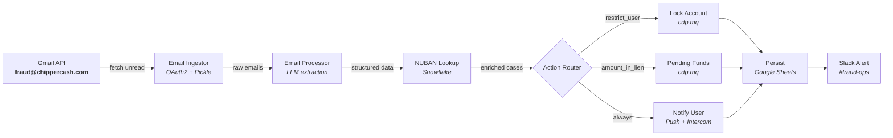
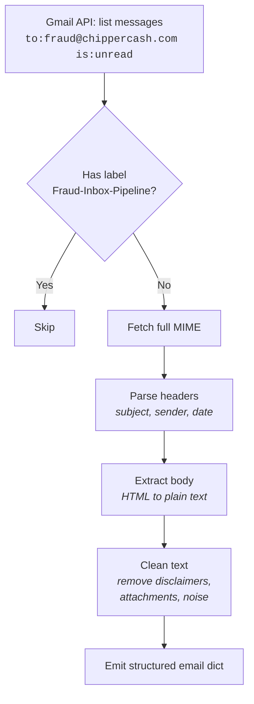
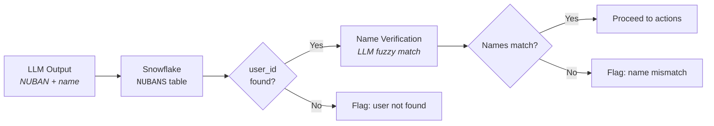
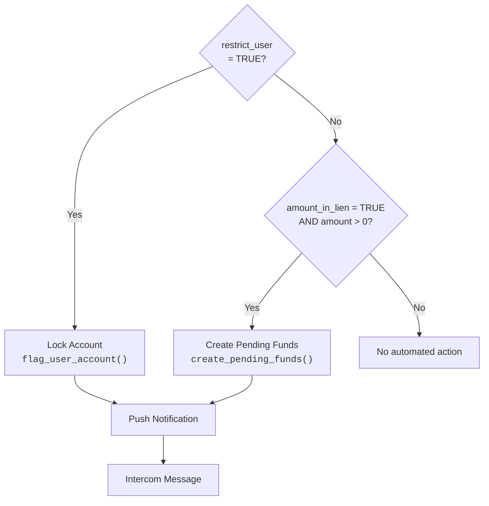

Every day, Chipper Cash receives fraud alerts from our banking partners and vendors, flagging suspicious transactions involving our users. Each alert contains account numbers, transaction references, and instructions to restrict or place liens on funds. Before, an analyst manually read each email, cross-referenced the account in three different dashboards, copy-pasted user data into a Google Sheet, and drafted a response. The whole process took ~30 minutes per email. On a busy day, that adds up to hours of repetitive work where a single miss can lead to fraud exposure.

I built a pipeline that processes each email in under 20 seconds. The full run, including Gmail polling and batch processing, completes in about 5 minutes. No analyst has to touch it, and every action posts a Slack notification and writes an audit trail.

## The manual workflow

The fraud team's process looked like this:

1. Open `fraud@chippercash.com` in Gmail
2. Read the alert, identify the type (fraudulent transaction, erroneous transfer, etc.)
3. Extract account numbers, amounts, and transaction references from the email body
4. Look up each account number in Retool to find the Chipper `user_id`
5. Check the user's transaction history and wallet balance
6. Place a lien or lock the account using a separate Retool tool
7. Send the user a push notification and an Intercom message
8. Log everything in a Google Sheet
9. Draft a response email to the sender

Three things kept breaking:

**Speed.** A single email with multiple users could take 30+ minutes. Fraud exposure is extremely time sensitive.

**Accuracy.** Manual extraction from unstructured emails led to typos in account numbers and missed users, especially when a single email listed five or six beneficiaries in a table.

**Auditability.** The Google Sheet was the system of record, but entries depended on who filled them in and when. There was no link between the action taken and the email that triggered it.

## System architecture

The pipeline runs every 3 minutes on a GCP instance, orchestrated by a single Python entrypoint. It has five stages, each independently testable.



There is no custom API server. The pipeline is a batch job: fetch, process, act, persist, alert. Each stage passes plain Python dictionaries forward, and if one email fails at a stage, the others still proceed.

## Stage 1: Email Ingestion

The first problem was reliably pulling emails from Gmail without reprocessing old ones.

I use the Gmail API's `messages.list` with a query filter:

```text
to:fraud@chippercash.com is:unread
```

After processing, each email gets a Gmail label (`Fraud-Inbox-Pipeline`) applied. The next run excludes labeled emails, so Gmail itself becomes the deduplication layer. That's simpler than maintaining a separate state table.



**Authentication** runs through OAuth2 pickle files. On GCP, interactive browser flows aren't possible, so I generate pickle files locally using a helper script and deploy them alongside the code. The token auto-refreshes on expiry.

**Text cleaning** is worth mentioning. Partner emails arrive as HTML with legal disclaimers, embedded images, and formatting artifacts like branded hashtags. The cleaning pipeline strips all of this down to the transaction data the LLM actually needs: it removes attachment references, strips hyperlinks, cuts disclaimer sections, and normalizes whitespace. Noisy input leads to noisy extraction.

## Stage 2: LLM-Powered Email Parsing

A partner alert is unstructured text with no consistent format, no API, and no CSV attachment. The same information (account number, amount, transaction reference) appears in different positions depending on the email type and the email sender.

I send each cleaned email to an LLM with a strict JSON schema and a classification prompt.

### The Four Email Types

| Classification                                     | Meaning                                        | Typical Action      |
| -------------------------------------------------- | ---------------------------------------------- | ------------------- |
| Fraudulent Transaction Query (Primary Beneficiary) | User directly received fraudulent funds        | Lock account        |
| Fraudulent Transfer Query (Secondary Beneficiary)  | User received funds from a primary beneficiary | Lock account        |
| Erroneous Transfer Query                           | User received a mistaken transfer              | Place lien on funds |
| General Queries                                    | BVN requests, account statements, etc.         | Manual review       |

### What the LLM Extracts

For each email, the model returns structured JSON with the classification, a user count, action flags (`restrict_user`, `amount_in_lien`), and a list of users with their account numbers, amounts, names, transaction dates, and references.

The schema enforces that `user_count` must match the length of the `users` array. This constraint eliminates a common failure mode where the model hallucinates duplicate entries or miscounts.

Action detection is conservative. The `restrict_user` and `amount_in_lien` flags are set to `TRUE` only when the email explicitly requests restriction or a lien. If the language is ambiguous, the flags stay `FALSE` and the case routes to manual review. I would rather delay action than lock the wrong account.

## Stage 3: Identity Resolution

The LLM gives us a NUBAN account number. We need the Chipper `user_id`, which we obtain from a reverse lookup.

I query Snowflake's `NUBANS` table, which maps bank account numbers to internal user IDs:

```sql
SELECT USER_ID, ACCOUNT_NAME
FROM SNOWFLAKE_CORE.NUBANS
WHERE ACCOUNT_NUMBER IN (...)
```

This lookup does two things. First, it resolves identity: the NUBAN becomes a `user_id` we can act on. Second, it enables name verification: I send the sender's account name and the NUBAN table's name back to the LLM for fuzzy matching.

Why fuzzy matching? The sender might write "ABDULRAHMAN MUSA IBRAHIM" while our records show "IBRAHIM MUSA A." A strict string comparison would flag this as a mismatch and block the action. The LLM handles abbreviations, reordered names, and transliteration differences that regex can't.



## Stage 4: Automated Actions

Once we have a verified `user_id`, the pipeline takes action based on the email classification and the extracted flags.



**Account locking** goes through `cdp.mq.flag_user_account()`, our internal message queue that flags a user with reason `[FRAUD INBOX] NOTIFICATION - <SENDER>`. This is the same system the compliance team uses for manual flags, so existing downstream processes (transaction blocking, KYC holds) activate automatically.

**Pending funds** (liens) use `cdp.mq.create_pending_funds()` with a hold code tied to the case. The funds are frozen in the user's wallet but not debited. The compliance team decides the next step.

**User notifications** go out on two channels simultaneously: a push notification to the Chipper app explaining the temporary restriction, and an Intercom message creating a support thread for the user to respond.

The pipeline has a dry-run mode that skips all actions but logs what would have happened. I ran in dry-run for two weeks before enabling live actions, comparing the pipeline's decisions against the manual team's.

## Stage 5: Persistence and Alerting

Every pipeline run produces two outputs.

### Google Sheets

Each processed user becomes a row with 20 fields: pipeline run ID, email metadata, classification, user identity, amounts, and action summary. This preserves the spreadsheet workflow the fraud team already relies on. They have filters, conditional formatting, and pivot tables set up. I didn't want to break that.

### Slack Alert

A structured Slack message posts to the fraud-ops channel with run duration, email count, and per-user details:

```text
Fraud Email Pipeline: Run Succeeded
Run started at: April 21, 2026 13:27:33 UTC
Run ended at:   April 21, 2026 13:27:56 UTC
Duration:       12.9 seconds
Total emails:   1

USER DETAILS
USER_ID: random-user-id
Email Type: Fraudulent Transfer Query (Secondary Beneficiary)
Actions: lock_account, notification, intercom
Stakeholders: @Nripesh
```

The alert tags the fraud analysts so they can verify the action and follow up if needed.

## What we chose not to build

Early designs included a custom Retool frontend, a Snowflake-backed case management system, and a draft-reply generator. I descoped all three.

**No custom case management.** The Google Sheet is the existing workflow. Adding a database-backed UI would mean migrating the team's setup for minimal benefit. I kept what was working fine, and what the team preferred.

**No auto-reply drafts.** Responses to each sender follow strict templates (RFI verbiage for primary beneficiaries, secondary beneficiaries, and erroneous transfers). The fraud team fills in dates and amounts manually, a 2-minute task once the data is pre-populated. Automating the remaining 2 minutes wasn't worth the risk of sending a malformed response to a banking partner.

**No Pub/Sub.** Gmail's push notification system would reduce latency to seconds, and it's probably where we'll end up. But for v1, I wanted to ship fast and keep the launch simple. Polling every 3 minutes has fewer moving parts to operate and debug, and we can swap in push later.

## Results

The pipeline has been running in production for 6 months.

| Metric                       | Before                      | After                      |
| ---------------------------- | --------------------------- | -------------------------- |
| Time per email (single user) | 30 mins                     | under 20 seconds           |
| Time per email (5+ users)    | 45 to 60 min                | under 20 seconds           |
| Full pipeline run            | N/A                         | under 3 minutes            |
| Missed accounts per week     | 2 to 3                      | 0                          |
| Action audit trail           | Manual sheet entry          | Automatic (Sheets + Slack) |
| Account lock latency         | Hours (business hours only) | under 3 minutes (24/7)     |

The biggest win is coverage. The pipeline runs around the clock, so overnight alerts are already processed, accounts locked, and users notified by the time an analyst opens Slack.

## What's next

Three items on the roadmap:

1. **Pub/Sub ingestion.** When the compliance team's SLA moves to real-time, we switch from polling to push. The pipeline architecture doesn't change, only the trigger mechanism.
2. **Snowflake persistence.** As case volume grows, we'll need queryable history beyond what Sheets supports. The data model is already designed (`fraud_case` + `fraud_case_event`), waiting for the operational need.
3. **Auto-drafted replies.** Template-based responses saved as Gmail drafts on the original thread. The analyst reviews and clicks send.

Each extension slots into the existing five-stage pipeline without restructuring. The stages pass dictionaries with a known schema, so adding a new consumer is just adding a new stage.

---

_If you're building something similar for automated triage of structured alerts from unstructured email, the pattern generalizes: ingest, parse with an LLM, resolve identity, take action, persist._
