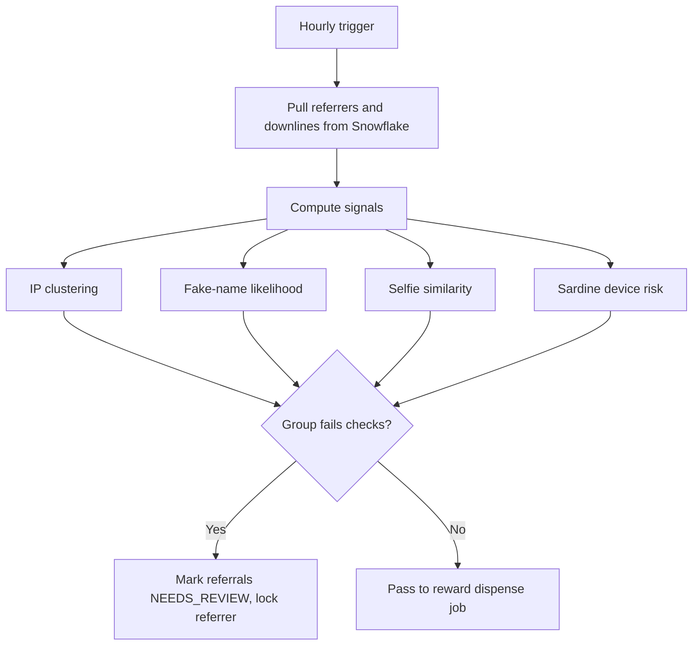
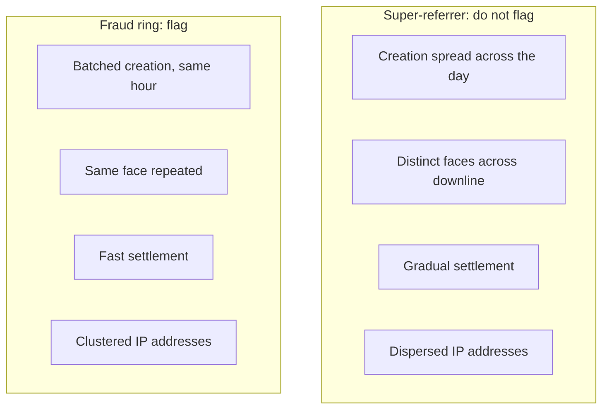

Referral fraud is a precision problem rather than a volume problem. Most fraud announces itself as a spike: something that should be rare suddenly is not, and you flag it. Referral fraud does not, because it hides inside real viral growth. The signal everyone reaches for first, referral count, is the one that fails, because the best legitimate growth and the worst fraud ring draw the same near-vertical curve. The work is separating the two without burning either.

The two failure modes are symmetric, and both cost real money. Under-detect, and you pay rewards to accounts farmed with stolen identities. Over-detect, and you throttle the growth loop the campaign exists to create, because every false positive is a real referrer who stops inviting people. This piece follows the primer [Fraud Archetypes](/work/the-fraud-archetypes) and takes referral fraud end to end: the surge that exposed a blind detector, the analysis that found the real signals, the validation service we built around them, and the month it failed silently and paid out ~$150K.

## The surge

In September 2021, Nigerian referrals climbed to roughly 50,000 a day, and the referral endpoint was handling around 1,200 requests per second. From the infrastructure pov, a campaign that is working and a campaign that is being farmed look almost identical: both draw a vertical line. The difference is composition, which a requests-per-second graph cannot show. We paused the campaign temporarily to give ourselves room to look.


_Daily referrals through the surge, broken out by settlement status. Real growth and a fraud ring draw the same curve._

## Why the detector was blind

We already had a detector. The Referral Validation Service had been live since November 2020, flagging referrers on two signals, IP-address clustering and fake-name likelihood, and it had locked hundreds of accounts. During the surge it flagged none of the 100,000 referrals.

The reason is the lesson of the whole piece. Earlier referral fraud had relied on accounts with gibberish names ("aaaa", "ghfhdf"), and our fake-name signal was tuned to catch exactly that. This time the fraudsters used fake and stolen BVNs (Bank Verification Numbers, Nigeria's bank identity numbers), and a BVN carries a real, legitimate-looking name. The names were no longer fake, so the fake-name signal had nothing to find. The detector had not broken; it was catching last year's fraud. A fraud control is a position you have to keep defending, because the adversary watches what you catch and changes it.

## Finding the real signals

We could not trust the old signals and could not flag on volume, so we sampled referrers from the surge and reviewed them by hand, sorting each into legitimate or fraudulent and asking what separated the two.

The legitimate side was the growth we had to protect. Most referrers brought in three to eight friends; genuine super-referrers, sharing their code on Twitter, YouTube, and in WhatsApp groups, brought in fifty or more, and a few brought in over four hundred. These were the most valuable users on the platform, and flagging even one is a false positive that costs more than the fraud. One user had over four hundred lifetime referrals but only five during the surge; another made twenty-one and had simply gone viral. Flagging on referral count alone flags your best users, which is why count is not usable as a signal on its own.

Roughly 20% of the sample was fraudulent: stolen BVNs mass-creating accounts to farm payouts. The names looked real and the IPs were only suggestive. What gave the fraud away was the face. Every account had completed a FaceTec liveness selfie, and when we pulled the selfies for a referrer's downline and viewed them together, the same face, or a few accomplices, recurred across dozens of supposedly unrelated accounts. A real super-referrer's downline is a hundred different faces; a fraud ring's is one face under a hundred names.

The review turned into four signals we could compute:

- **IP clustering.** Fraud accounts share IP addresses, so a referrer with several clusters of accounts on the same address is suspect. The caveat is that cohabiting users at schools, offices, and hostels share addresses too, which is why this was never trusted on its own.
- **Time to settle.** Fraud referrals settle quickly; legitimate ones settle gradually as real users fund their accounts. Useful as confirmation after the fact, not as a pre-payout signal.
- **Creation-time spread.** Fraud accounts are created in tight batches within the same hour; real referrals arrive spread across the day.
- **Selfie similarity.** Whether a referrer's invited users share a face. This is the signal that lasts, because it is the only one a fraudster cannot evade cheaply. IPs can be rotated, settlement slowed, creation spread out; a face has to be found, alive, for every account. It does not raise the cost of the fraud at the margin, it changes what the fraud requires.

## The validation service

The Referral Validation Service (RVS) is an hourly Python batch job, not a service with an API. It reads fresh data from Snowflake, computes the signals for the referrers in the current window, and runs immediately before the job that dispenses rewards, so the order is validate, then pay. A flagged referral is caught before payout rather than clawed back after, which matters because clawback here is mostly fiction: the money is already gone. When a referrer's group fails, the job marks the sibling referrals NEEDS_REVIEW, pulling them from the reward queue, and locks the referrer's account. Run once over historical data at launch, it locked 680 accounts.



**IP clustering.** Device IDs were unreliable and non-unique, so we used shared IP addresses as a proxy for "the same hand." For each referrer we tally the IPs across their invited accounts and flag the referrer when at least three IPs are each shared by more than four accounts. The thresholds were tuned against confirmed cases rather than taken from a textbook.

```python
clusters = {}                      # ip -> set of invited user ids
for user in invited_users(referrer):
    for ip in ips_observed(user):
        clusters[ip].add(user.id)

large_clusters = [ip for ip, users in clusters.items() if len(users) > 4]

if len(large_clusters) >= 3:
    flag(referrer)
```

Mobile IPs are not fixed; the telco reassigns them every few hours. That sounds like it should weaken the signal, but it sharpens it. Legitimate referrals trickle in over days while fraud arrives in bursts, so accounts sharing an IP despite constant rotation were almost certainly created together on one device before the address changed.


_Referrers ranked by their largest IP cluster. A dorm or office produces a small shared cluster; the right tail is not cohabitation._

**Fake-name likelihood.** The original signal scored names with character trigrams. We built a table of three-letter sequences from verified real names, kept the common ones, and treated a name as fake when neither its first nor last name contained any common trigram. "Robert" is built from frequent trigrams and passes; "ghfhdf" is not and fails. The BVN attack defeated this precisely because it worked: the stolen names were real, so they were full of common trigrams and passed cleanly. We had been checking whether names were real, and the fraudsters had switched to real names.

**Selfie similarity and device intelligence.** The durable fix was the selfie-similarity check (status `FLAGGED_BY_SIMILAR_SELFIE`) over the liveness selfies from SmileID and FaceTec, flagging a referrer when their invited users share a face. We later added Sardine, a device-intelligence provider, and flagged a referral when both the referrer and the invited user carried a very-high device-risk score. Requiring both sides kept it from firing on the noise of a single risky device.

## The silent failure

The most expensive lesson was not about signals. While refactoring the pipeline, a bug switched off the Sardine checks for roughly a month, from late August to mid-September 2022, and nothing reported it. In that window about 71,000 referrals that would have been flagged settled and were paid, around half of all settled referrals in the period, at a cost of roughly $135K to $140K. With Sardine dark, those accounts also bypassed the selfie check.

Nothing alerted. The pipeline kept reading from Snowflake, kept marking some referrals for review, kept paying rewards; by every surface signal it was healthy. We found the gap sideways, when someone noticed the deposit-conversion rate for new users had fallen and pulled the thread: real new users fund their accounts, fake referral mills do not, so a flood of unfunded accounts had dragged the rate down in a different dashboard entirely.

A detector that fails silently is worse than no detector, because you keep trusting it. The fix was about the system's honesty rather than its signals: data-quality alerting (Great Expectations, Datafold) that fires when a check stops producing results or a settled-referral rate jumps, and porting the referral logic into dbt so it is version-controlled, tested, and cannot lose a limb in a refactor without a test failing.

## The false-positive tax

The opposite failure has its own bill, paid in Uganda. UGX referrals fell from about 3,000 a day to about 1,000, a two-thirds collapse, and across 76,000 referrals over a month only about 43% settled. The rest were referrals we had collected and then strangled before payout. About 12,777 sat in NEEDS_REVIEW from a third-party device tool (IPQS) misfiring its "multiple referrals on one device" check on roughly fifty innocent users; we replaced it with in-house fingerprinting. The larger share was stuck in PENDING because invited users never finished verification, driven by a FaceTec selfie rejection rate around 80%, real people rejected four times in five until they gave up.

Uganda had no super-referrers; referrals were spread evenly, with no viral tail to protect. So over-flagging there was not one costly mistake on a high-value user but a broad, quiet tax on every ordinary referrer. Nigeria showed the cost of too little recall, $140K paid to fraud in a silent month; Uganda showed the cost of too little precision, a growth loop cut by two-thirds. The same system, mistuned in opposite directions, fails in opposite and equally expensive ways.

## What it comes down to

Referral count, the obvious signal, points straight at the super-referrers you most need to keep, so the work is in the signals that separate the two shapes count cannot.



The face is the one the fraud cannot fake: every other signal tells the adversary what to change next, while the selfie check tells them to find another person. And a detector you cannot test or alert on will fail quietly and keep your trust while it does. The $140K month did not happen because the signals were wrong; it happened because the pipeline could lose a limb without anyone hearing it. Running detection as a tested, observable pipeline rather than a clever script is the discipline that later carried into the broader monitoring stack, the automated fraud desk and the console our analysts work from. It started here, with one campaign and one face repeated across a hundred names.
