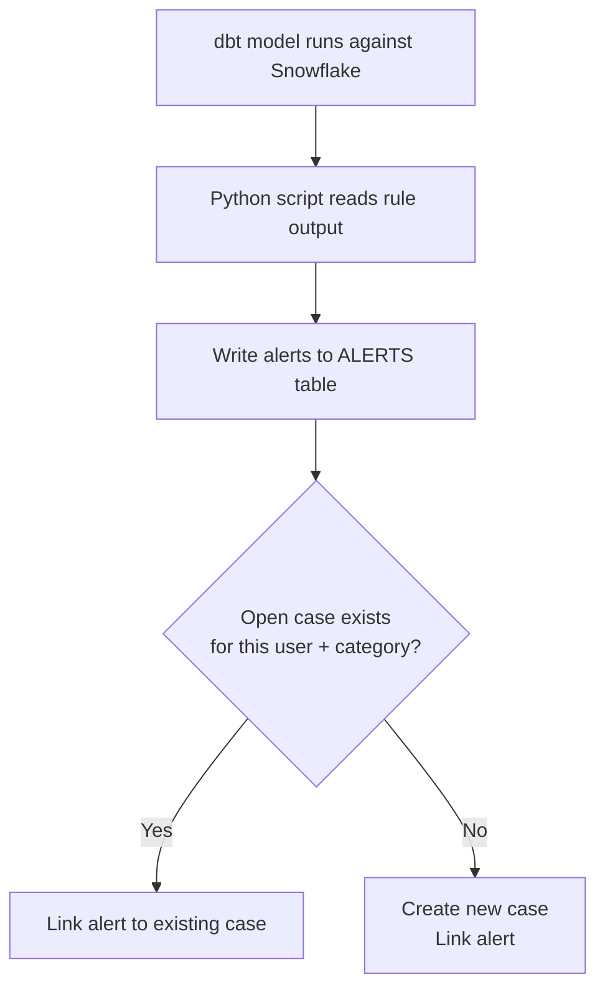
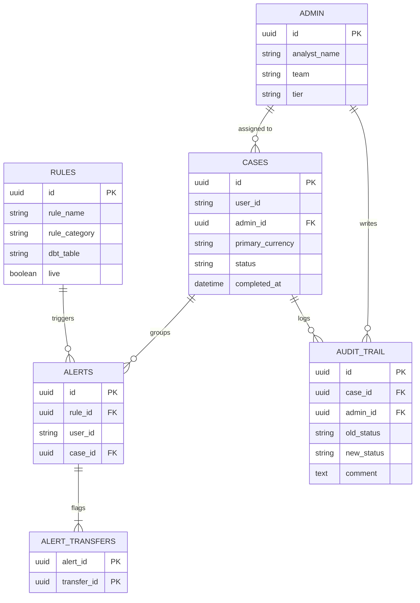
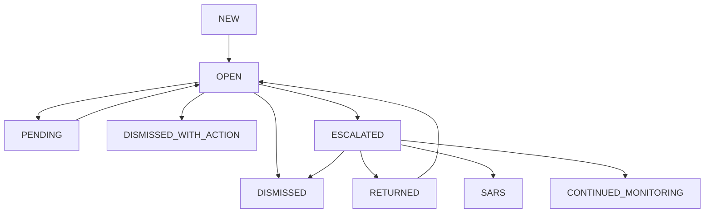

This is a closer look at the technical architecture of the [compliance platform I built](/work/replacing-a-compliance-vendor) to replace a $250K/year vendor: the transaction monitoring engine, the data model, and the controller layer.

## The transaction monitoring engine

The TM engine is a Python script on a cron schedule. It turns dbt output into alerts and cases in five steps:

1. Query the dbt model for a given rule. Each rule maps to a table that outputs `user_id` and `list_txn_ids` for users in violation.
2. Write new alerts to `ALERTS`.
3. For each alert, check if an open case already exists for that `user_id` in the same `rule_category`.
4. If yes, link the alert to the existing case.
5. If no, create a new case and link the alert.



The pipeline runs offline, on a batch schedule. Cron handles orchestration, and the script writes alerts straight to the database; nothing else sits in between.

**Why not an API?** An API layer would allow webhook-driven alerts and real-time case creation. But direct database writes shipped faster, were easier to debug, and reduced the failure surface. The pipeline currently processes 35 rules generating 53,000+ alerts, and the architecture has held. I will add an API layer if and when external integrations justify the overhead.

## The data model

Every design decision here was driven by one question: what queries will analysts and the pipeline need to run most often?



The model fits in six tables, none of them using inheritance, polymorphism, or JSON columns.

### Rules

```text
RULES
  id              uuid, primary key
  rule_name       "Value Limit Sent", "Elder Abuse"
  rule_category   "Transaction Monitoring", "Fraud", "Crypto Monitoring"
  dbt_table       "RULE_VALUE_LIMIT_SENT"
  live            boolean
```

Every TM rule maps to exactly one dbt model via `dbt_table`. The `live` flag lets us disable a rule without deleting it. We currently have 35 active rules across four categories.

`rule_category` drives case routing. Transaction Monitoring alerts go to the TM queue, Fraud alerts to the Fraud queue. When the compliance team decided Elder Abuse alerts belonged in the Fraud queue instead of TM, the fix was a single update to this field.

### Alerts

```text
ALERTS
  id              uuid, primary key
  rule_id         FK to RULES
  user_id         the flagged user
  case_id         FK to CASES
```

Each alert represents one user violating one rule at one point in time. **Alerts are stateless**, carrying no lifecycle of their own; the case they belong to holds the state.

The median case has 1 alert, but the average is 2.6 because users often trigger multiple rules. The most-alerted case has 629, a user who kept triggering rules across months under continued monitoring.

### Alert Transfers

```text
ALERT_TRANSFERS
  alert_id        composite PK, FK to ALERTS
  transfer_id     composite PK
```

This mapping table links alerts to the transactions that triggered them. 590,000+ mappings across 53,000+ alerts, with a median of 4 transfers per alert. Analysts rely on this to see the exact transfers behind a flag.

### Cases

```text
CASES
  id                uuid, primary key
  user_id           the flagged user
  admin_id          FK to ADMIN (assigned analyst)
  primary_currency  NGN, UGX, USD, GHS, ...
  status            NEW, OPEN, DISMISSED, ESCALATED, SARS, ...
  completed_at      null until terminal status
```

A case groups alerts at the user level. The key constraint: **a user can only have one open case per `rule_category` at a time.** New alerts for a user with an existing open case link to that case rather than creating a duplicate.

I put `status` directly on the case row instead of normalizing it. This keeps the most common query fast:

```sql
SELECT * FROM cases WHERE status = 'OPEN' AND admin_id = ?
```

The trade-off is in-place updates on every status change. The audit trail preserves full history, so nothing is lost.

The status distribution across 20,000+ cases:

| Status                | Cases | Meaning                                       |
| --------------------- | ----- | --------------------------------------------- |
| DISMISSED             | 9,035 | Legitimate activity                           |
| DISMISSED_WITH_ACTION | 6,909 | Suspicious, action taken, below SAR threshold |
| NEW                   | 1,835 | Not yet assigned                              |
| SARS                  | 896   | SAR filed with regulator                      |
| CONTINUED_MONITORING  | 845   | Under ongoing surveillance                    |
| ESCALATED             | 515   | Awaiting MLRO review                          |

### Audit Trail

```text
AUDIT_TRAIL
  id              uuid, primary key
  case_id         FK to CASES
  admin_id        FK to ADMIN
  old_status      previous status
  new_status      new status
  comment         investigation notes
```

The audit trail is append-only: no row is ever updated or deleted. Every status change is logged with the analyst's identity and comments, and this becomes the compliance team's proof of work for regulators.

The typical case has 2 entries (assignment + resolution). Cases that go through escalation carry more: analyst notes, escalation comment, MLRO review, SAR decision. Over 6,600 cases have 3 to 5 actions.

### Admin

```text
ADMIN
  id              uuid, primary key
  analyst_name    display name
  team            ANALYST, LEAD, MLRO, ADMIN
  tier            drives permissions
```

The `tier` field determines what an analyst can see and do:

| Tier   | Permissions                                               |
| ------ | --------------------------------------------------------- |
| TIER_1 | Self-assign, dismiss, escalate                            |
| LEAD   | All of TIER_1, plus reassign, reopen, view all team cases |
| MLRO   | Handle escalated cases, file SARs, return cases           |
| ADMIN  | Full access                                               |

## The controller layer

Controllers sit between the Retool front-end and the database. They enforce business rules that should not live in the UI.

### Case Assignment Controller

- Tier 1 analysts can only assign cases **to themselves**
- Leads can assign or reassign **to any analyst**
- MLROs can self-assign escalated cases

The controller checks the user's tier before permitting any assignment. During rollout, the compliance team tested this immediately, asking what happens when an analyst tries to assign a case to someone else. The answer was nothing: the controller refuses the request before it reaches the database.

### Case Status Update Controller

Not every transition is valid. The controller validates three things:

1. **The transition is permitted** from the current status. An analyst cannot jump from `OPEN` to `SARS`.
2. **The user's tier allows the action.** Only MLROs can transition to `SARS` or `CONTINUED_MONITORING`.
3. **A comment is provided.** The controller enforces this, not just the UI.



If any check fails, the transition is rejected. This protects case integrity even if someone bypasses the front-end.

### Audit Trail Controller

The Audit Trail Controller is invoked automatically by the other two. Every assignment, status change, and comment is logged without any analyst input, and the append-only rule allows no exceptions.

## Design decisions

**Postgres for the application, Snowflake for analytics.** The live system runs on Postgres. Fivetran syncs these tables to Snowflake as views in `SNOWFLAKE_COMPLIANCE`. Analytics queries never compete with the live application's reads and writes.

**Denormalized status on cases.** The current status and assigned analyst live directly on the case row, trading in-place updates for faster reads. The audit trail preserves the full history, so nothing is lost. The alternative would have meant joining to a status history table on every query, slowing down the views analysts use all day.

**No deletes, anywhere.** Disabled rules flip `live` to `FALSE`, and dismissed cases change status rather than disappear. No row ever leaves the database. Regulators want the full history, and so do we when debugging.

**UUIDs everywhere.** The application layer generates them, not the database. This lets the TM engine assign a case ID before insertion, so a case and its alert links can be written atomically in a single transaction.

**`completed_at` for open case detection.** The TM engine checks `completed_at IS NULL` rather than matching against a list of terminal statuses. The query is faster, and it tolerates new statuses being added, which happened three times in the first month.

## What's next

For the detection layer, [how I standardized 35 rules across seven markets in dbt and how I tune them in production](/work/standardizing-detection-rules).
