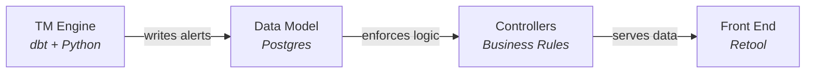
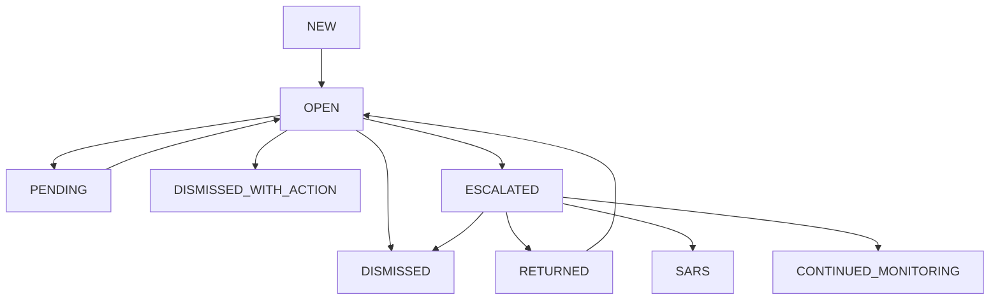

At Chipper Cash, our compliance team reviews thousands of transaction monitoring alerts every week across multiple African markets. For over three years, that workflow ran on a third-party case management vendor at $250K per year, with our data behind their API and every rule change spread across two systems. Analysts spent the first few minutes of every investigation gathering context across three separate dashboards. And measuring anything (rule efficacy, analyst throughput, time-to-resolution) meant exporting data out of the vendor and joining it back with our own tables.

I built an in-house case-management platform to replace it. The system has been in production for two years, processing over 53,000 alerts, 20,000 cases, and 900+ SAR filings across seven markets.

This is the first of three pieces. The next two go deeper on the [architecture](/work/designing-the-compliance-platform) and on [the detection rules](/work/standardizing-detection-rules) that power the system.

## Why we moved off the vendor

Three problems pushed me to build in-house.

**Limited context per case.** The vendor only displayed what we explicitly sent through its API. To decide whether to dismiss or escalate, analysts had to cross-reference transaction history in one tool, KYC details in another, and account flags in a third. Investigations started with context-gathering rather than analysis.

**Inflexible rule integration.** Our transaction monitoring rules run as dbt models against Snowflake. Getting alerts into the vendor required a separate pipeline that transformed dbt output into the vendor's API format. Every new rule or threshold change meant updating the dbt model and the integration layer, leaving our data model split across systems we didn't fully control.

**Locked-in data.** Measuring rule efficacy or analyst productivity required exporting data from the vendor and joining it with internal tables in Snowflake. We were paying to make our own data less accessible.

## What the compliance team needed

Before writing any code, I sat with analysts and Money Laundering Reporting Officers (MLROs) to map the workflow they actually performed. The requirements distilled to five things:

1. **A single queue of unassigned cases**, grouped by rule category: Transaction Monitoring, Fraud, Crypto
2. **Self-assignment** so analysts pick cases from the queue and own them
3. **Tiered review** where Tier 1 analysts dismiss or escalate, and MLROs handle escalations and file Suspicious Activity Reports (SARs)
4. **An immutable audit trail** logging every action with timestamps and the analyst's identity
5. **Investigation context in one place**: transaction details, user profiles, KYC status, without switching tools

Analysts did not need a new product. They needed their existing workflow consolidated with proper access controls.

## Four components

I designed the platform around four components. Each maps to a distinct concern in the system.

**Transaction Monitoring Engine.** TM rules are dbt models that run against Snowflake and output users in violation. A Python script reads each rule's output and writes alerts directly to Postgres. If a user already has an open case for the same rule category, the alert links to the existing case. Otherwise, a new case is created.

**Data Model.** The relational backbone: rules, alerts, cases, audit trail, and admin roles. Cases group alerts at the user level. Each case tracks its status, assigned analyst, and associated transfers. The schema was designed around the queries analysts and the pipeline run most often.

**Controllers.** The business logic layer between the front-end and the database. Controllers enforce permissions: Tier 1 analysts dismiss or escalate, leads reassign and reopen, MLROs file SARs. Every status transition is validated before it reaches the database. Every action writes to the audit trail automatically.

**Front End.** A Retool application where analysts work cases. It surfaces data from the model through the controllers: unassigned alerts, case details, associated transfers, investigation notes, and the full audit trail.

For a deeper look at these four components, see [Designing the compliance platform](/work/designing-the-compliance-platform).

## Scoping the MVP

I shipped in under three months by making three scoping decisions.

**One country first, all alerts.** Nigeria drives 85% of our case volume. Launching there let me validate the full lifecycle, from alert generation through investigation to SAR filing, before solving for other markets' regulatory nuances. Uganda, US, Ghana, and Rwanda were added incrementally.

**Retool for the front-end.** The compliance team was already familiar with Retool from other internal tools. It gave me tables, filters, role-based views, and comment inputs out of the box. The trade-off is real: Retool has limits around custom workflows and polish. But for an internal tool, shipping fast mattered more.

**Direct database writes instead of API.** The TM engine writes alerts directly to Postgres instead of going through an API layer. It was simpler to build, easier to debug, and had fewer failure points. I deferred an API-based architecture to a future phase where external integrations might justify the overhead.

## The analyst workflow

An analyst logs in and sees the **Bundled Alerts** queue: unassigned cases grouped by rule category. Each row shows the user, triggered rules, primary currency, and alert creation time. The analyst selects a case, picks their name from the Admin dropdown, and hits **Assign**. The case moves to their **My Open Cases** tab.

Below the queue, **Alert Assignments** shows every analyst's tier and open case count. Leads use this to monitor workload across the team.

From the case detail view, the analyst has everything in one place:

- **Associated Alerts**: which rules fired and when, color-coded by category
- **Associated Transfers**: the transaction IDs that triggered the flag
- **Audit Trail**: every action on this case with analyst name, tier, status change, and investigation notes

The analyst reviews the evidence, writes investigation notes, and takes action: **dismiss** if the activity is legitimate, or **escalate** to the MLRO queue. Team leads can **reassign** or **reopen** cases.

MLROs see escalated cases in a separate queue. They can return a case to the analyst, initiate a SAR filing, or place the user on continued monitoring. The SAR workflow generates filings in the format required by the relevant regulator: FinCEN e-filing for the US, goAML XML for Uganda.

The audit trail records every action automatically. Regulators expect a complete record of who reviewed what, when, and why, and that's what the system produces.

## What we chose not to build

Features I cut from MVP:

- **SAR filing integration.** MLROs used existing channels initially. We added FinCEN and goAML later.
- **Bulk actions.** No bulk close, assign, or comment. Cases were worked individually.
- **Link analysis.** Showing connections between flagged users. Useful for network fraud, not essential for core review.
- **Custom rule builder.** Rules are managed in dbt by the data team, not through the UI.
- **Ongoing monitoring.** Dismissed cases stayed dismissed. No snooze or scheduled re-review.
- **Document uploads.** Analysts could not attach evidence to cases.

Each feature eventually made it onto the roadmap. Cutting them meant we shipped in weeks, not quarters.

## The feedback loop

The platform evolved faster than I expected after launch. The compliance team logged requests in a shared Notion doc that became the product backlog. I held bi-weekly syncs with analysts and MLROs to prioritize. Some changes were small, others reshaped the system.

**A new permission tier.** The MVP had two tiers: Analysts and MLROs. Within weeks, the team needed a Lead tier. Leads required visibility into all team cases, the ability to reassign work between analysts, and the authority to reopen dismissed cases for quality review. I added `LEAD` as a full tier with its own permission set.

**Manual investigations.** Automated rules cover known patterns, but analysts also needed to investigate users flagged through ad-hoc tips or external requests. I built a Manual Cases workflow where a `user_id` is all you need to open an investigation. The system creates a case with the same tooling as automated ones: audit trail, status lifecycle, MLRO escalation. The constraint was ensuring manual cases followed the same one-open-case-per-user rule.

**An expanded status lifecycle.** The MVP launched with five statuses. Within the first month, the team needed three more. MLROs asked for `RETURN` to send cases back to analysts, `DISMISSED_WITH_ACTION` for suspicious activity below the SAR threshold where action was taken on the account, and `CONTINUED_MONITORING` for ongoing surveillance. Tier 1 analysts needed `PENDING` for cases awaiting additional information.

_The case status lifecycle after iterating with the compliance team. The MVP launched with five statuses. Three were added in the first month based on analyst and MLRO feedback._

**Workload visibility.** Team leads had no way to see how cases moved through the system. I added an All Cases view with filters by analyst, status, rule category, and date range, giving leads the ability to track throughput and spot bottlenecks.

This tight loop, where the compliance team surfaces a gap and sees it addressed within days, is something a vendor tool could never match.

## Results

The platform has been in production for over two years.

| Metric                  | Value                  |
| ----------------------- | ---------------------- |
| Alerts generated        | 53,000+                |
| Cases created           | 20,000+                |
| SARs filed              | 900+                   |
| Unique users flagged    | 16,600+                |
| Active rules            | 35 across 4 categories |
| Markets covered         | 7+ (17 currencies)     |
| Audit trail entries     | 50,000+                |
| Transfer-alert mappings | 590,000+               |

The $250K annual vendor contract is gone. More importantly, the compliance team operates on a system we fully control. Adding a new rule means writing one dbt model, not coordinating across two platforms.

## What's next

For the technical architecture, see [Designing the compliance platform](/work/designing-the-compliance-platform). For how the detection layer works across seven markets, see [Standardizing detection rules](/work/standardizing-detection-rules).
