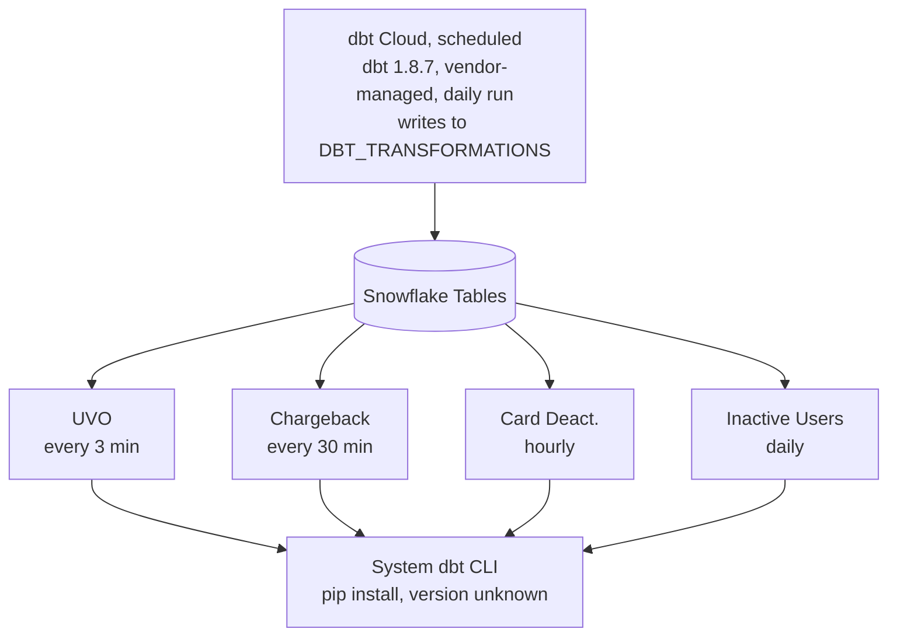
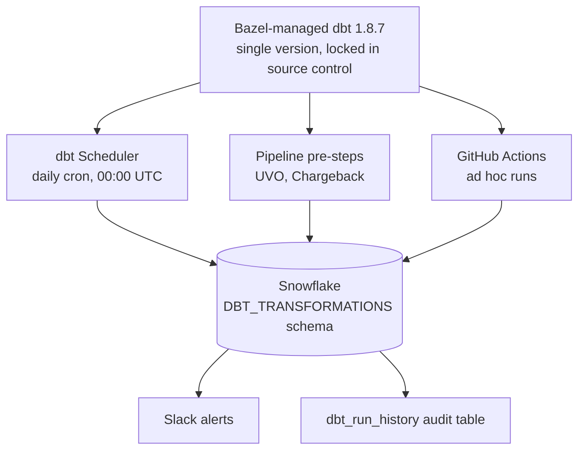

In 2025, Chipper Cash's data transformations grew to around 900 dbt models powering compliance, fraud detection, and growth systems for over seven million customers across nine African countries. Some of the pipelines that depend on these models run every three minutes. They need dbt output to be fresh, correct, and reliable.

For four years, dbt Cloud orchestrated our transformations. Then a one-line configuration change broke our most critical pipeline silently. This is the story of what went wrong, how I fixed it, and why I ultimately replaced dbt Cloud with a self-hosted solution.

Our architecture had developed an unintentional split.

## Two runtimes, one time bomb

dbt Cloud owned the daily scheduled refresh of all models, running dbt 1.8.7 and writing to our production `DBT_TRANSFORMATIONS` schema in Snowflake. But several pipelines like user verification, chargeback processing, card deactivation also invoke dbt as a pre-step before executing their own business logic. These pipelines called the `dbt` CLI binary directly, relying on whatever version happened to be pip-installed on our GCP VM.



We had two runtimes with no version coordination. Any change to `dbt_project.yml` that relied on newer dbt syntax would work in dbt Cloud but break on the VM, or vice versa.

## The incident

We updated `dbt_project.yml` to use the `data_tests` configuration key, introduced in dbt 1.8 as a replacement for the deprecated `tests` key. dbt Cloud, running 1.8.7, handled it without issue. The system-installed dbt on our GCP VM was older. It rejected the configuration:

```text
ERROR: Runtime Error
  Additional properties are not allowed ('data_tests' was unexpected)
Error encountered in dbt_project.yml
  Could not run dbt
```

Our User Verification Oracle (UVO) pipeline assigns KYC tiers to every user on the platform. It runs every three minutes via cron. Its shell script executed `dbt run`, received this error, and then moved on to the next step as though nothing had happened. The script lacked `set -e` which would have halted execution on any non-zero exit code. Without it, the dbt failure was invisible. The UVO engine continued running, processing stale data from the last successful dbt refresh.

Because of this bug, users were not receiving tier updates. Cronitor, which tracked the pipeline's overall exit code, saw a success because the final `bazel run` step, the UVO engine itself, completed without error. It had no way to know that the data it operated on was days old.

We discovered the problem when a team member noticed that tier assignments had stopped changing.

## How I built the replacement

Our codebase uses Bazel to manage Python dependencies hermetically. We already had a thin Python wrapper around dbt's CLI (`dbt.invoker`) that invokes dbt programmatically and raises exceptions on failure:

```python
def invoke(*args, **kwargs):
    """Invoke dbt with the given arguments. Raises on failure."""
    with _in_dir(DBT_DIR):
        res = dbt.cli.main.dbtRunner().invoke(list(args), **kwargs)
        if not res.success:
            if res.exception:
                raise res.exception
            raise ResultExitException(res.result)
    return res.result
```

Bazel locks the `dbt-core` and `dbt-snowflake` versions in the build graph, packaging them alongside the dbt project files (`dbt_project.yml`, `profiles.yml`, model SQL). Every invocation then whether from the daily scheduler, a pipeline pre-step, or a CI job will use the exact same dbt binary built from the same dependency tree.

The migration had three components.

### 1. Hermetic pipeline scripts

Every shell script that previously called the system `dbt` CLI was updated to invoke dbt through Bazel. I also added `set -e` to ensure dbt failures halt the pipeline immediately.

```bash
# Before: system dbt, no error handling
#!/bin/sh
cd dbt
dbt run --select user_data.user_verification_oracle --full-refresh \
  --target PROD --profiles-dir .
dbt test --select user_data.user_verification_oracle \
  --target PROD --profiles-dir .
cd ..
bazel run //pipelines/offline/user_verification_oracle_v2:uvo_main

# After: Bazel-managed dbt, fail-fast
#!/bin/sh
set -e
bazel run //dbt -- run --select user_data.user_verification_oracle \
  --full-refresh --target ${CDP_ENV:-PROD}
bazel run //dbt -- test --select user_data.user_verification_oracle \
  --target ${CDP_ENV:-PROD}
bazel run //pipelines/offline/user_verification_oracle_v2:uvo_main
```

The `--profiles-dir .` flag is no longer necessary as `dbt.invoker` handles the working directory internally. If any step fails, `set -e` stops execution and returns a non-zero exit code. Cronitor sees the failure and alerts the team.

### 2. Self-hosted dbt scheduler

I built a Python pipeline (`dbt_scheduler`) that runs daily at midnight UTC via cron. It determines the run mode, incremental on most days, full refresh on the first of each month, and invokes dbt through the same Bazel-managed invoker, parses the run results JSON, persists per-model execution history to a Snowflake audit table (`dbt_run_history`), and posts a Slack summary with success and failure counts.



If any model fails, the scheduler raises an exception with the list of failed models, and posts an error alert to Slack with stakeholder mentions, and exits with a non-zero code for Cronitor.

### 3. Ad hoc runs via GitHub Actions

The most-used feature of dbt Cloud was the ability to trigger one-off jobs like a full refresh after merging a PR that changes a cost formula, for instance. I replaced this with a GitHub Actions workflow supporting two trigger modes.

**Manual trigger** from the GitHub Actions UI. Engineers select the model, target environment, and whether to run a full refresh.

**PR comment trigger.** Engineers comment on any pull request:

```text
/dbt-run --select transaction_data --target PROD
```

The workflow checks out the PR branch, runs dbt via Bazel against Snowflake, and posts the result back on the PR as a comment and to Slack. This lets engineers validate dbt model changes against production data before merging.

## Results

I ran the self-hosted scheduler in parallel with dbt Cloud for a week, writing to a test schema. After verifying output parity across all 920 models, I cut over to the self-hosted scheduler targeting the production schema. dbt Cloud jobs were paused as a rollback path for another week before decommissioning.

|                                          | dbt Cloud                              | Self-hosted                  |
| ---------------------------------------- | -------------------------------------- | ---------------------------- |
| dbt version management                   | Managed by vendor                      | Locked in Bazel BUILD file   |
| Runtime consistency                      | Two runtimes, diverging                | Single runtime everywhere    |
| Ad hoc run access                        | dbt Cloud UI (limited seats)           | GitHub Actions (repo access) |
| Failure detection                        | Silent with no pipeline-level alerting | `set -e` + Cronitor + Slack  |
| Time to detect the `data_tests` incident | silent bug                             | Would be immediate           |

## Lessons learned

**Hermetic builds are non-negotiable for data pipelines.** When a version mismatch can cause silent data staleness in a compliance-critical system, "it works on dbt Cloud" is not a sufficient guarantee. Every execution path needs the same managed version, and that version needs to be tracked in source control.

**Silent failures are the most expensive kind.** The incident wasn't caused by a complex bug. It was a one-line config change and a missing `set -e`. What made it costly was that nothing stopped the pipeline from proceeding with stale data. I have since audited every shell script in our pipeline fleet for error handling.

**Replace managed services incrementally.** Running in parallel before cutting over gave me confidence that no model output had diverged. Keeping dbt Cloud paused rather than deleted gave me a rollback path while I built trust in the new system.
