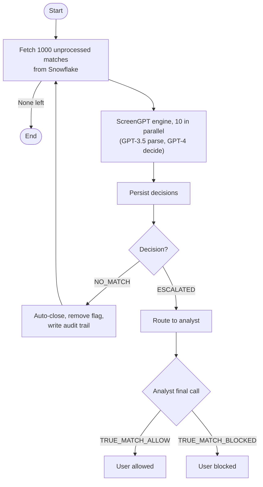

On September 19, 2024, our screening pipeline stopped working without failing. The nightly Slack message still reported the run complete, the monitors showed no errors, and the stats read like a healthy day: 1,000 cases processed in 215 seconds. It was persisting zero rows, and it took six days for anyone to notice.

That incident is the honest centerpiece of this piece, so it ends there. It only mattered because there was a system worth breaking: the pipeline that ran ScreenGPT ([Part 1](/work/screengpt-the-system), [Part 2](/work/screengpt-trusting-an-llm)) over a backlog of roughly 148K screening hits.

## The backlog pipeline

The interactive app, where an analyst reads ScreenGPT's adjudication one alert at a time, does not drain a six-figure backlog. For that there is a second mode, and it is simpler than people expect: a Python batch job, not an API server. It fetches 1,000 unprocessed matches from Snowflake, runs them through the two-model engine, and persists the decisions. A second job acts on them: NO_MATCH alerts are auto-closed, escalations are routed to an analyst for the final call.

Deciding and acting are deliberately separate phases. The gap between them is a checkpoint where decisions can be inspected before any of them change a user's status. Automate aggressively, but never auto-clear a true hit.



A screening takes about 20 seconds, almost all of it API latency, which puts the backlog at roughly 820 hours run sequentially. The work is I/O-bound, so the job holds 10 matches in flight inside OpenAI's rate limits and the average drops to about 2 seconds. A 10x improvement from nothing more clever than not waiting on one request before starting the next.


Before trusting the auto-close path, the screening team hand-reviewed a sample of 326 closures. They disagreed with 2, both partial last-name matches where the analyst wanted to escalate. That is exactly where [Part 2](/work/screengpt-trusting-an-llm) says the residual risk lives, and it is why the QC continued after launch.

## Escalation rates belong to the data

The backlog cleared in cohorts, and the cohorts behaved differently. The sanctions backlog auto-closed at 94 percent, the shape you expect when most hits are common-name collisions. A cohort of June 2023 NGN Tier 2 alerts split nearly 50/50.


The difference is the system working, not failing. That cohort genuinely contained more ambiguous matches, and the model surfaced them instead of guessing. A pipeline that auto-closed 94 percent of everything would be cheaper, faster, and exactly the kind of system that eventually clears a true hit.

## The cost of a screening

Each screening makes two API calls. The GPT-3.5 parse costs about a tenth of a cent; the GPT-4 decision about four cents, which is 97.6 percent of the total. The whole backlog came to about $6,000.

There was an obvious way to make it 10x cheaper: run the decision on GPT-3.5 too, for roughly $450 total. We measured it and declined. Accuracy drops twelve points, the decision notes degrade into justifications an analyst cannot audit, and the loss concentrates in exactly the recall direction we protect. Saving $5,500 once against the possibility of clearing a sanctioned person is not a trade.


## The silent failure

Then OpenAI deprecated `gpt-3.5-turbo`, the model behind the parse step. The parse call began failing silently, the dataframe came back empty, and the persist step wrote nothing while logging a clean exit:

```
Skipping run_many: empty dataframe
Data persisted to database | {"num_inserts": 0}
```

By its own definition of failure, the job was healthy: it ran on schedule, reported completion, and inserted zero rows for six days. Nobody was paged because nothing we monitored had changed. We were watching whether the job ran, not whether it did work. The screening team caught it by noticing the backlog had stopped shrinking.


The fix was one line, swapping in `gpt-4o-mini`. The real repair was the follow-up: a catch-up run over the skipped week, and alerts that surface insert counts, so a run that processes 1,000 and persists 0 pages a human. The lessons are unglamorous. A deprecated model is a well-defined failure and should raise a loud error, not an empty dataframe that flows quietly downstream. Monitor output, not liveness. And a pipeline built on a vendor's models inherits the vendor's deprecation schedule, so check model versions before they disappear, not after.

The mercy of this incident is that the pipeline made no wrong decisions during those six days; it made none at all. The uncomfortable version of the same fact: a system that silently does nothing looks identical to a working one from every dashboard we had.

## What production means

Production for this system is three things that are really one. Scale: a batch job, 10 in flight, draining 148K hits cohort by cohort. Cost: four cents a screening, with a 10x-cheaper path declined because the error asymmetry is not negotiable. Drift: a vendor deprecation that turned the pipeline into a convincing imitation of a working system for six days.

The discipline is the same in all three. The restraint that keeps the model from clearing a true hit is the restraint that refuses to trust a green dashboard. A batch job that reports success is not a batch job that did work, and we learned that the way most teams do: six days late, from the people downstream who noticed the work had stopped.
