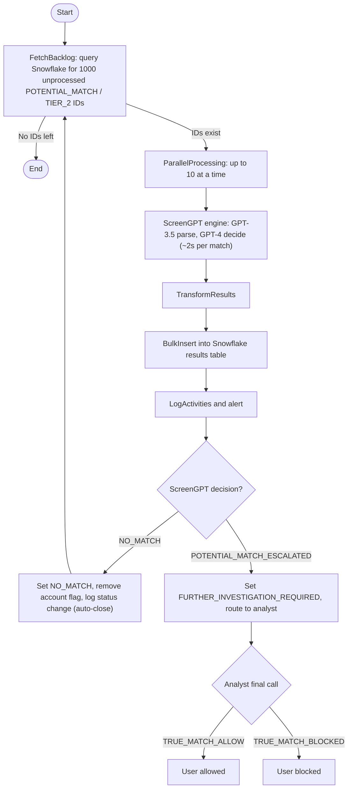
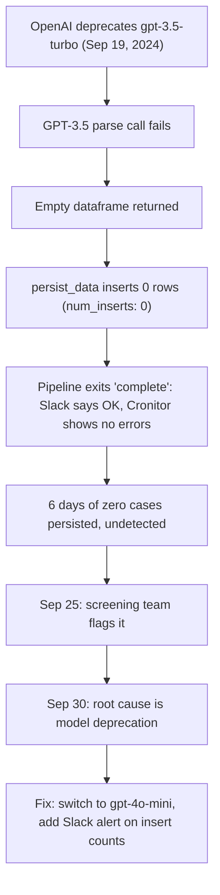

On September 19, 2024, the backlog pipeline stopped doing its job, and nothing told us. It did not crash or throw. The Slack message at the end of every run still reported the run complete, Cronitor showed no errors, and the stats read like a healthy day: 1,000 cases processed, 215 seconds elapsed, 0.215 seconds average per case. By every signal we had wired up the job was fine, and yet it was inserting zero rows. OpenAI had deprecated `gpt-3.5-turbo`, the model behind the first of the two calls in the screening engine; the parse call failed, the dataframe came back empty, and the persist step wrote nothing while logging `{"num_inserts": 0}` and exiting clean. For six days the backlog quietly stopped draining.

This piece is about operating ScreenGPT in production. [Part 1](/work/screengpt-the-system) built the system: an OpenSanctions match, parsed by GPT-3.5, adjudicated by GPT-4 against a decision-tree prompt, returning a decision, a reason, a grounded note, and a confidence level. [Part 2](/work/screengpt-trusting-an-llm) proved we could trust it, through a golden dataset, a confusion matrix, and the one metric we protect above all others: POTENTIAL_MATCH recall, because the cost of errors is asymmetric. A false positive wastes an analyst's time; a false negative onboards a sanctioned person.

Operating it meant three things at once: draining a real backlog of about 130K users and 148K hits at scale, doing it at a defensible cost, and surviving the day the pipeline broke without telling anyone. The through-line is that a batch job which reports success is not the same as a batch job that did work, and the restraint that protects against false negatives in the model has to protect against silent failure in the pipeline too. That failure is the climax of this piece, but it only mattered because there was a production system worth breaking, so let me describe that first.

## There is no API server

The interactive app from Part 1 is one way ScreenGPT is used: an analyst opens an alert, ScreenGPT adjudicates it, and the analyst reads the note and decides. That does not drain a backlog of 148K hits. For that there is a second mode, simpler than people expect: not a custom API server but a Python batch job that fetches a batch of unprocessed watchlist IDs, processes them through the two-model engine, transforms the results, persists them, and logs and alerts. A second job then acts on what the first decided, auto-closing NO_MATCH alerts and routing POTENTIAL_MATCH_ESCALATED alerts to a human.

The split into two phases is deliberate. Phase 1 produces a decision and writes it down; Phase 2 reads the decision and changes the world, closing alerts, removing account flags, handing escalations to people. Keeping them separate means we can run, inspect, and quality-check the decisions before any of them change a user's status. Automate aggressively, never auto-clear a true hit, and keep a checkpoint between deciding and acting where a human can still look.



_Figure 1: The two-phase backlog pipeline. Phase 1 fetches a batch, runs the two-model engine in parallel, and persists decisions. Phase 2 acts on each decision, auto-closing NO_MATCH and routing POTENTIAL_MATCH_ESCALATED to an analyst._

## Phase 1: getting the decision

Each run of the first job fetches 1000 unprocessed watchlist matches from Snowflake, filtered to POTENTIAL_MATCH entries belonging to TIER_2 users. It only pulls IDs not processed before, so reruns are safe and the backlog drains monotonically. Those matches then go through the two-model engine, and this is where the throughput story lives.

Run sequentially, screening takes about 20 seconds per match, a number from Part 1 that is almost entirely OpenAI API response time, dominated by the GPT-4 decision call. That is fine for an analyst clicking through alerts one at a time, but a non-starter for 148K hits: at 20 seconds each, the backlog is roughly 820 hours of wall-clock time sat waiting on a remote API.

So the batch job processes up to 10 matches at a time in parallel, inside OpenAI's rate limits. The work is I/O-bound, almost all of it spent waiting on the network, so parallelism is close to free: we are not adding compute, only stopping the job from sitting idle. Average time per match drops from about 20 seconds to about 2, a 10x throughput improvement, from doing nothing more clever than not waiting on one request before starting the next.


_Sequential versus parallel throughput. With up to 10 matches in flight, average time per match drops from about 20 seconds to about 2, because the work is dominated by waiting on the API._

The planning math used a more conservative 3 seconds per screening, which puts the full 150K-item backlog at roughly 125 hours. Either way the point holds: parallelism turns "weeks of a job running" into "a few days," the difference between the backlog being a project and a permanent fact of life.

Each result is written to a Snowflake results table. The row carries the watchlist ID, the decision, the decision reason, the full note, a confidence value, the watchlist and user data as JSON, and a timestamp. That table is the record of what the model decided and why. It is also, as it turned out, the thing whose row count we should have been watching far more closely.

## Phase 2: closing alerts

Phase 1 decides; Phase 2 acts, branching on the decision. On NO_MATCH, the second job auto-closes the alert: it sets the watchlist status to NO_MATCH, removes the account flag so the user is no longer held up, and writes a row to the status-changes table for the audit trail. No human touches it. This is the bulk of the work and the entire reason the pipeline exists, because the overwhelming majority of screening hits are false positives.

On POTENTIAL_MATCH_ESCALATED, nothing gets auto-cleared. The job sets the status to FURTHER_INVESTIGATION_REQUIRED, writes the status change, and routes the case to an analyst, who makes the final call: TRUE_MATCH_ALLOW and the user is allowed, or TRUE_MATCH_BLOCKED and the user is blocked. The machine narrows the field; a person makes the decision that carries regulatory weight. That asymmetry, automate the NO_MATCH and escalate everything else, is the production expression of the logic from Part 2. We are willing to spend analyst time on false escalations; we are not willing to have the machine clear a true hit.

### Quality-checking the auto-closures

Auto-closing is the part with no human in the loop, so it is the part that should make you nervous. Before trusting it at scale, the screening team pulled a sample of ScreenGPT's closures and had analysts re-review them by hand. They reviewed 326 cases and disagreed with ScreenGPT on 2, a disagreement rate of about 0.6%.

Those two disagreements are worth more than the headline number, because of which way they failed. Both were partial matches on the last name where the analyst wanted to escalate and ScreenGPT had returned NO_MATCH: precisely the recall-protecting failure mode from Part 2, where the dangerous direction is a true hit cleared as NO_MATCH. Two cases out of 326 was enough confidence to proceed, but the residual error is not random noise. It sits exactly where the asymmetry says it costs the most, which is why escalation thresholds and ongoing QC are not optional.

## Draining it, batch by batch

The backlog was cleared in cohorts, and the cohorts behaved differently from each other. The first batch, all backlog from August 2023, was 864 cases at about 87% auto-closed. The entire SANCTIONS backlog, 6,770 cases, came in at about 94% auto-closed, 6,385 NO_MATCH against 385 escalations. That is the shape you hope to see: sanctions hits are overwhelmingly common-name collisions, and the model cleared the vast majority while flagging a few hundred for human eyes.

The June 2023 NGN Tier 2 cohort did not behave like the others at all. Across 22,273 cases it split nearly 50/50, 10,864 NO_MATCH against 11,409 POTENTIAL_MATCH, an escalation rate roughly half against the single-digit percentages of the sanctions backlog. That gap is the most honest thing in this piece, and I will not smooth it over: escalation rate is a property of the cohort, not a constant of the system. The NGN Tier 2 population genuinely produced more ambiguous, closer-call matches, and the model surfaced them rather than guessing. A pipeline that auto-closed 94% of every cohort would be cheaper and faster and exactly the kind of thing that eventually clears a true hit. The right behavior is for the escalation rate to move with the data.


_Outcomes by batch. NO_MATCH dominates the sanctions backlog, while the June 2023 NGN Tier 2 cohort escalated at nearly 50%._

Later cohorts covered the oldest PEP Tier 2 NGN users and the remaining monthly alerts. By the time of writing, June through September were complete, with roughly 30,000 cases left for October through December, all NGN Tier 2. The backlog had stopped being a wall and started being a burn-down.

## What it cost

Every screening makes two OpenAI calls. GPT-3.5-turbo parses the structured fields out of the OpenSanctions match payload, and GPT-4 makes the screening decision against the decision-tree prompt. The cost of the pipeline is the cost of those two calls multiplied by 148K, and at OpenAI list pricing the arithmetic on a representative screening is simple.

The GPT-3.5-turbo parse call consumes about 559 input tokens and 60 output tokens. At $0.0015 per 1,000 input tokens and $0.002 per 1,000 output, that is about $0.00096, roughly a tenth of a cent. The GPT-4 decision call consumes about 941 input tokens and 188 output tokens; at $0.03 per 1,000 input and $0.06 per 1,000 output, that is about $0.0395, roughly four cents. Combined, about $0.04 per screening, of which the GPT-4 decision is about 97.6% and the parse is rounding error. The honest answer to what ScreenGPT costs to run is that it costs whatever GPT-4 costs.

Across the backlog, that is the number that matters: 150K items at four cents each is about $6,000 to drain the entire queue, one that was growing faster than a team of analysts could keep up with. Against the loaded cost of the analyst hours it replaces, that is not a close call.


_Per-screening cost. The hybrid path costs about four cents, of which the GPT-4 decision is about 97.6%. The GPT-3.5-only path is roughly 10x cheaper, and 12 accuracy points worse._

### The cheaper path, and why we did not take it

There is an obvious way to make this 10x cheaper: run both calls on GPT-3.5-turbo and never pay for GPT-4. The math is real. Parsing stays at $0.00096, and the decision call at GPT-3.5 pricing is about $0.0018 for the same 941 input and 188 output tokens, for a total of about $0.0027 per screening, roughly a third of a cent. Across 150K items that is about $450 instead of about $6,000, more than $5,000 off the backlog bill.

We did not take it, for the reason that is the entire thesis of Part 2. GPT-3.5-only accuracy drops from 82% to 70%, twelve points, and the cost number does not capture the worst of it: the quality of the GPT-3.5 decision reasoning falls off a cliff into incoherent answers, hallucinated justifications, decision reasons that read like gibberish. A NO_MATCH from GPT-4 comes with a grounded note an analyst can audit; a NO_MATCH from GPT-3.5 too often comes with a note that means nothing.

Run the asymmetry. The downside of paying four cents instead of a third of a cent is about $5,500 across the whole backlog, once. The downside of a 12-point accuracy drop, concentrated in exactly the recall direction we protect, is the possibility of clearing a sanctioned person and a regulatory breach. Those are not on the same scale. So the strategy is hybrid: GPT-3.5 for parsing, where it is cheap and good enough, and GPT-4 for the screening decision, where the accuracy and auditable reasoning are the product. We locked in that split deliberately, through the prompt iteration I will come to. First, the day it stopped working.

## The day it broke: the September 2024 post-mortem

On September 19, 2024, the pipeline stopped persisting cases. It did not crash or throw; it kept running on schedule, kept reporting itself complete, and kept inserting zero rows. The Slack alert said "Pipeline run complete," Cronitor showed no errors, and the job's own stats from a "successful" run looked healthy: total processed 1000, elapsed 215 seconds, average 0.215 seconds per match, duration about 3.59 minutes. It reported processing 1000 cases and inserting 0. Every signal we were watching was green.

Nobody noticed for six days, because the pipeline was not failing in any way our monitoring understood. On September 25 the screening team noticed the backlog was not actually going down and flagged it. The investigation was a process of elimination. On September 26 we checked the OpenAI API limit, reviewed the Cronitor logs, and confirmed the Slack alerting was reporting the pipeline complete, all clean: it genuinely was not failing by its own definition of failure. On September 29 we found no new entries in the results table, which confirmed the persist step was failing, and the logs told the story plainly:

```
Skipping run_many: empty dataframe
Data persisted to database | {"num_inserts": 0}
```

The dataframe was empty before it ever reached the database. On September 30 we found the root cause: OpenAI had deprecated `gpt-3.5-turbo`. The parse call, the first of the two model calls, failed silently; with no parsed fields the dataframe came back empty; with an empty dataframe the persist step had nothing to insert, logged `num_inserts: 0`, and returned cleanly. The job exited "successfully" because, by its own logic, inserting zero rows from zero inputs is not an error.




_The September 2024 silent failure: a deprecated model failed the parse call, the dataframe came back empty, and the persist step inserted zero rows while the job reported success._

The fix, on September 30, was small: swap the deprecated model for OpenAI's recommended `gpt-4o-mini` and merge. The follow-ups on October 1 were the part that mattered: run a catch-up over the backlog the pipeline had quietly skipped, and add Slack alerts that include the pipeline stats, so that `num_inserts: 0` is something a human sees instead of something buried in a log. No wrong decisions were made during those six days, because the pipeline produced nothing at all. That is the small mercy. But the backlog stopped draining and no one knew, and that is the failure.

The lessons we wrote down were three, and none of them are subtle. Improve error logging: a deprecated model is a clean, well-defined failure that should have produced a loud error, not an empty dataframe flowing quietly through every downstream step. Improve monitoring: the job alerted on whether it ran, not on whether it did work, and a run that processes 1000 and inserts 0 should page someone. And check model versions regularly, because a pipeline built on a vendor's models inherits the vendor's deprecation schedule, and we needed to catch a model going away before it took the pipeline down, not after. A batch job that reports success is not the same as a batch job that did work; we knew that about the model and had to learn it about the pipeline.

## The prompt-iteration discipline

Auto-closing 6,385 sanctions cases without a human in the loop was only defensible because the GPT-4 decision prompt had been ground down over many documented iterations until it actually worked, against a stated goal of 90% precision on NO_MATCH and 80% overall accuracy. The arc, not the enumeration, is the point.

Early versions were not trustworthy, and they failed in instructive ways. The model could not recognize a transposed name, and it treated a missing middle name as a real mismatch, so an obvious match would come back as NO_MATCH for reasons that had nothing to do with whether the people were the same. Concatenating the name fields and stripping fluff from the prompt helped at the margins, but the reasoning still broke on the hard cases.

The turning point was to stop writing one prompt that did everything and split it in two: a procedural decision tree, and a separate set of matching criteria. The tree is procedure: match the name, then the date of birth, then the gender; fail any step and the answer is NO_MATCH; reach the end and it is POTENTIAL_MATCH_ESCALATED; treat missing data at a step as a match and proceed, because absence of evidence is not evidence of a mismatch. The criteria are the definitions the tree calls into, including what counts as a name match with transposition and sound-alike guidance. Separating the procedure from the definitions is what made the model's behavior legible and consistent.

Rewriting the prompt cleanly around that structure is also where we locked in the hybrid model split, GPT-3.5 for extraction and GPT-4 for the decision, and reached the precision goal: 100% precision on NO_MATCH on the evaluation set, against a 90% target. The structural move that got us there, separating the decision tree from the matching criteria, is the same move that makes the model auditable. An analyst can read the tree, read the note, and check the work. That is what made it safe to point at a backlog and let it run.

## What "production" actually means here

Production for this system is three things that are really one. It is scale: a Python batch job, 1000 at a time, 10 in parallel, draining about 148K hits cohort by cohort, auto-closing the false positives and routing the close calls to people. It is cost: about four cents a screening, about $6,000 for the whole backlog, with a 10x-cheaper path we did not take because the asymmetry between $5,500 saved and one sanctioned person cleared is not a real choice. And it is drift: the day a vendor deprecated a model, the pipeline kept reporting success while doing nothing, and it took six days and the monitoring we should have had from the start to notice.

The thread tying them together is the asymmetry. It tells you to escalate rather than guess, to pay for the better model, and, just as firmly, that a green pipeline is not a working pipeline. The discipline that protects against a false negative in the model is the same discipline that protects against a silent zero in the database. Restraint in the decision and skepticism toward your own success signals are not two practices but one. We learned that the way most teams do, six days late, from the people downstream who noticed the work had stopped. The fix was four lines of alerting; the lesson was the whole system.
