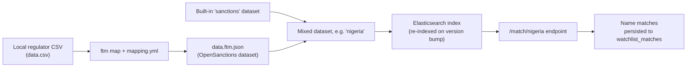
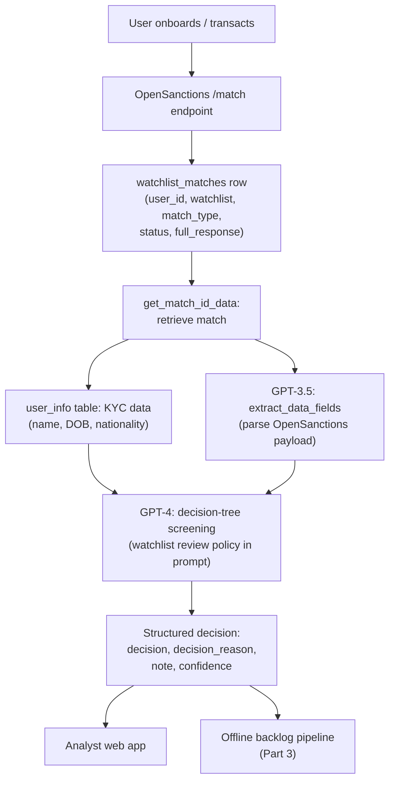
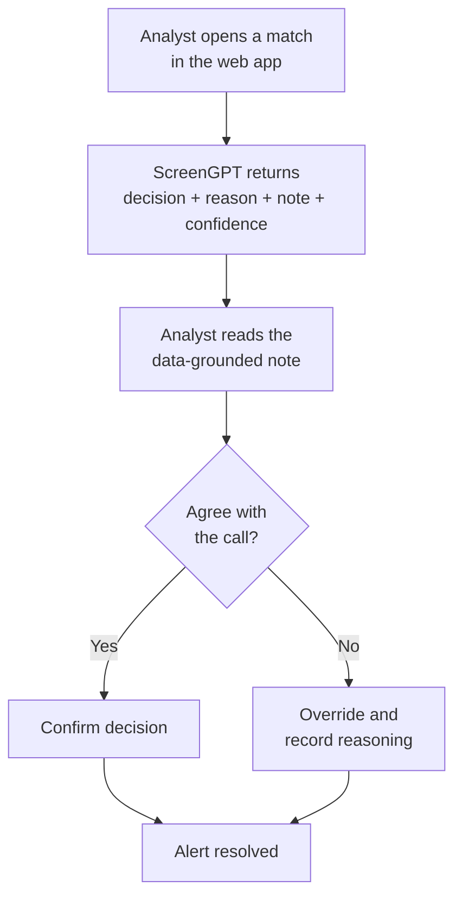

Sanctions screening generates an overwhelming majority of false positives, and you are not allowed to ignore a single one of them. A common name collides with a listed entity, an alert fires, and an analyst has to look at it. The alerts arrive faster than analysts can clear them, the backlog grows, and the one thing you cannot do to shrink it is guess.

ScreenGPT is the system we built at Chipper Cash to adjudicate those alerts. OpenSanctions returns a name match, GPT-3.5 extracts the structured fields from that match payload, GPT-4 runs the screening decision against a decision tree encoded in its prompt, and the pipeline returns a structured decision with a written, data-grounded justification. Each match takes roughly 20 seconds. On a 269-case evaluation set it catches 93.55% of the matches that genuinely warranted escalation, and that number is the one the entire design exists to protect.

This is the first of three pieces. This one covers the architecture: the problem, the asymmetry that shapes every decision, where the matches come from, the two-model pipeline, and how an analyst uses the output. [Part 2](/work/screengpt-trusting-an-llm) covers the evaluation: the golden dataset, the confusion matrix, and why one recall number gets protected above everything else. [Part 3](/work/screengpt-in-production) covers production: the offline pipeline that drains the backlog at scale, the economics, and a regression that taught us how careful you have to be.

## The problem and the asymmetry

When a user onboards or transacts, you screen their identity, name, date of birth, nationality, against global sanctions lists, politically-exposed-person (PEP) lists, and custom local lists specific to a market. The screening engine, OpenSanctions in our case, returns "matches": entries whose name is close enough to the user's to warrant a look. The overwhelming majority are false positives, because names are not unique. A user who shares a name with a sanctioned individual will trip the screen even though they are a different person on a different continent.

You cannot ignore those alerts anyway. If one true match is cleared by mistake, you have onboarded a sanctioned person, a regulatory violation that draws fines, consent orders, and a hard look at whether your license should stand. So every alert gets reviewed: a human reads the watchlist entry and the KYC data and decides whether this is the same person. The math does not work in your favor, because alert volume grows with the user base while review time per alert is bounded by how fast a person can read and reason. The backlog is not a temporary spike but the steady state, and it gets worse the more you grow.

What determines everything downstream is that the two ways this system can be wrong are not equally costly. A **false positive** is an alert you escalate that turns out to be nobody; the cost is analyst time, expensive in aggregate but recoverable, since someone reads it, confirms the collision, and moves on. A **false negative** is a true hit you clear: you let a sanctioned person through, and you find out you were wrong only when someone else does, in an audit or an investigation. Accuracy treats both errors as equal. The business does not.

So the system is built with a deliberate bias: when in doubt, escalate. We would rather hand an analyst a hundred collisions to dismiss than clear one real hit. The published version of this stance, from an earlier fraud-desk system, was "I would rather delay action than lock the wrong account." The screening version is its mirror: I would rather escalate a false positive than clear a true hit. This asymmetry is the design constraint, not a footnote. It tells you which errors to tolerate, which metric to protect, and how to read every number the system produces, and it is the entire subject of [Part 2](/work/screengpt-trusting-an-llm).

## Where the matches come from

Before the pipeline can adjudicate a match, OpenSanctions has to produce one, so it is worth understanding how it is wired. We started with OpenSanctions on a barebones server and re-architected it to be configurable, testable, and version-controlled. The driver was custom datasets: the built-in global sanctions data is necessary but not sufficient, because a given market often has a local regulatory list that you also have to screen against and that list is not in the public OpenSanctions corpus.

The server is configured through a `docker-compose.yml`, version-controlled in our compliance service, and the datasets it serves are declared in a `manifest.yml` referenced from that compose file. A custom dataset is defined by a path to its data file, a title, and a version number:

```yaml
datasets:
  - name: domestic_ngn_blocklist
    title: Domestic NGN PEP list
    path: /app/data/data.json
    version: '20230401004'
  - name: nigeria
    title: Custom Nigeria List
    datasets:
      - domestic_ngn_blocklist
      - sanctions
```

Two things in that snippet matter. The version number is load-bearing: every time it changes, Elasticsearch re-indexes the dataset, which is how you push an updated local list into the live index. And datasets compose. The `nigeria` dataset is not raw data of its own but a mix of the built-in `sanctions` dataset and the custom `domestic_ngn_blocklist`, so a request to `/match/nigeria` screens against exactly those two and nothing else. Screening is scoped per market by the dataset name in the match endpoint.

Getting a local regulator's list into OpenSanctions shape is a conversion job, handled by ftm (FollowTheMoney). The raw input is a CSV from the regulator, and a mapping file describes how its columns become entities:

```yaml
custom_ngn:
  queries:
    - csv_url: datasets/data.csv
      entities:
        member:
          schema: Person
          keys:
            - id
          properties:
            name:
              columns:
                - first_name
                - last_name
                - 'Middle Name'
              join: ' '
```

The conversion itself is a single command:

```
ftm map domestic_ngn_pep/mapping.yml -o domestic_ngn_pep/data.ftm.json
```

A dataset directory ends up holding three files: the raw `data.csv` from the regulator, the `mapping.yml` that describes the conversion, and the `data.ftm.json` that OpenSanctions serves. The whole config is version-controlled and redeployed when it changes.



The output of all this is rows in a `watchlist_matches` table. Each row is a candidate, a user whose identity matched something on a watchlist, and that row is where the pipeline picks up.

## The pipeline: two models, one decision

The pipeline takes a `match_id` and returns a screening decision in a handful of explicit steps, using two different models for two different jobs.

It begins by fetching the match from `watchlist_matches`, which yields five fields: `user_id`, `watchlist`, `match_type`, `status`, and `full_response`, where `full_response` is the raw OpenSanctions payload describing what got matched and why. Using `user_id`, it then pulls the corresponding KYC record from `user_info`: name, date of birth, nationality, and the rest of what we know about the person. Those are the only inputs to the decision: the five match fields keyed by `match_id`, and the KYC fields keyed by `user_id`.

Next, `extract_data_fields` calls GPT-3.5 to parse the verbose, inconsistent OpenSanctions payload into the structured fields that matter for screening. This is a bounded, mechanical parsing job rather than a reasoning job. The extracted fields and the KYC data then go to GPT-4, whose prompt contains a detailed decision tree following the watchlist screening procedure. The model is not freelancing a judgment; it walks the same review policy a trained analyst would, against the same data, and returns a decision with a reason. The pipeline emits that as a structured decision for the `match_id`, described in the next section.

The two-model split is the load-bearing engineering decision in the pipeline. Extraction is high-volume, low-stakes, and mechanical, so it goes to the cheap model. Screening is where being wrong is expensive and the reasoning has to hold up to audit, so it goes to the capable one. Putting GPT-4 on extraction would pay for reasoning you do not need; putting GPT-3.5 on the decision would save money in exactly the place the asymmetry says you must not. Pinning extraction to the cheaper model also keeps per-match cost down at scale, which is the lever that decides whether you can afford to run this against an entire backlog rather than a sample. That arithmetic is [Part 3](/work/screengpt-in-production).



The decision tree is doing a lot of work here. Screening is not "does the name match." A trained analyst compares names, dates of birth, nationalities, and identifiers, weighs partial matches, considers how distinctive the name is, and reasons about whether the listed entity and the user could plausibly be the same person. Encoding that procedure into the GPT-4 prompt is what makes the output a screening decision rather than a string-similarity score: the model does not invent a screening policy, it executes ours, and the policy is the thing we trust.

## The output schema

The pipeline returns four string fields, kept deliberately plain because the point is auditability, not cleverness.

- **`decision`**: the final call, either `POTENTIAL_MATCH_ESCALATED` or `NO_MATCH`.
- **`decision_reason`**: the precise reason that determined the decision, that is, the branch of the tree that fired.
- **`note`**: a detailed explanation that draws on actual data from both the watchlist entry and the KYC record, a specific argument grounded in this user and this match rather than a generic template.
- **`confidence`**: how sure the model is, as one of `Strongly Agree`, `Agree`, or `Neutral`.

The `note` is the field that makes the rest of the system usable. A bare `NO_MATCH` is an oracle, and you cannot audit an oracle. A `NO_MATCH` accompanied by "the listed entity was born in 1962 in a different country, the user was born in 1991, the names share only a common first name, and the listed individual's distinctive surname does not appear in the user's identity" is something an analyst can check in seconds and a regulator can review after the fact. Every decision carries its own justification, and that is the difference between a tool an analyst trusts and a black box they have to redo by hand. One naming detail: the output value is `POTENTIAL_MATCH_ESCALATED`, but the evaluation in Part 2 abbreviates the class to `POTENTIAL_MATCH`.

## How an analyst uses it

ScreenGPT is decision support, not a replacement for the analyst, and that distinction is structural rather than rhetorical: the output is built to be checked. The interactive path is a web app. An analyst pulls up a match, ScreenGPT returns its decision, reason, grounded note, and confidence, and the analyst reads the note, confirms it against the data, and either accepts the call or overrides it. The model does the first pass and the human keeps the final say. For a long backlog of obvious collisions, the model clearing the easy cases and writing down why is a large multiplier on how many alerts one analyst can get through in a day.



Beyond throughput, the system buys three things that are hard to get from human review alone. **Consistency:** the same policy applied the same way across cases and analysts, reducing the variance that creeps in when judgment calls are made by different people on different days. **Standardization:** a uniform screening practice, which is exactly what you want to be able to show when someone asks how your decisions get made. **Resource allocation:** the system fast-tracks the clearly clearable cases, so screening managers can point human attention at the genuinely ambiguous and risky cases instead of the hundredth name collision of the morning.

What it does not do is decide unilaterally on anything that matters. Escalations go to a person, clears are auditable and reversible, and the model's confidence is surfaced rather than hidden, so a `Neutral` reads differently from a `Strongly Agree`. Decision support means the analyst is still the decision-maker, working faster.

## Performance, briefly

The numbers are honest about where the system is strong and where it is deliberately loose. On the 269-case evaluation set, overall accuracy is 78.44%, but that figure is not very interesting on its own, because accuracy treats both error types as equal and the business does not.

The numbers that matter are the per-class ones. For `NO_MATCH`, precision is 92.23%: when ScreenGPT says "clear," it is right about 92% of the time. For `POTENTIAL_MATCH`, recall is 93.55%: of the matches that genuinely warranted escalation, it catches about 94%. That recall figure is the one the whole design protects, because it is the inverse of the false negative, the error you are not allowed to make.

The system is visibly biased in the direction the asymmetry demands. `NO_MATCH` recall is 65.52%, the weakest number in the report, meaning the model escalates a meaningful share of clearable cases that an analyst still has to dismiss. `POTENTIAL_MATCH` precision is 69.88%, the same over-escalation seen from the other side. Under any other objective those would be flaws to fix; under this one they are the acceptable error direction. The system is tuned to be loose about escalating and strict about clearing, which is exactly backwards from "maximize accuracy" and exactly right for "never clear a true hit."


_Precision and recall by class on the 269-case evaluation set. POTENTIAL_MATCH recall (93.55%) is the metric the asymmetric cost of errors protects._

End to end, a single match takes roughly 20 seconds. That latency is almost entirely OpenAI API response time rather than local compute, and it scales with how much data the prompt has to process. It is the input to the production economics: when you are draining a backlog of many thousands of alerts, 20 seconds per match and a per-call API cost are the numbers that decide whether the whole thing is viable. The full evaluation, the confusion matrix, the golden dataset, the GPT-3.5-versus-GPT-4 comparison, and the argument for why `POTENTIAL_MATCH` recall is the metric you defend above all others, is [Part 2](/work/screengpt-trusting-an-llm).

## What is next

Everything above is the interactive system, where an analyst pulls a match, ScreenGPT adjudicates it, and the analyst confirms or overrides. But the same function that takes a `match_id` and returns a decision can be pointed at the backlog itself. An offline batch pipeline runs ScreenGPT over the standing queue of alerts, clears the no-matches, escalates the rest, and drains a backlog that human review alone could never catch up to. That pipeline, its throughput and cost, a September 2024 regression that quietly broke it, and the prompt-iteration discipline that recovered it, are the subject of [Part 3](/work/screengpt-in-production).

The thesis carries through all three pieces: automate aggressively to clear the backlog, but never clear a true hit. The asymmetry is the whole game. Build the system to respect it, evaluate it against it, and run it in production without ever forgetting it.
