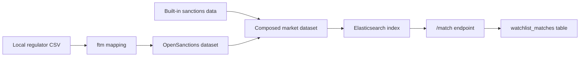
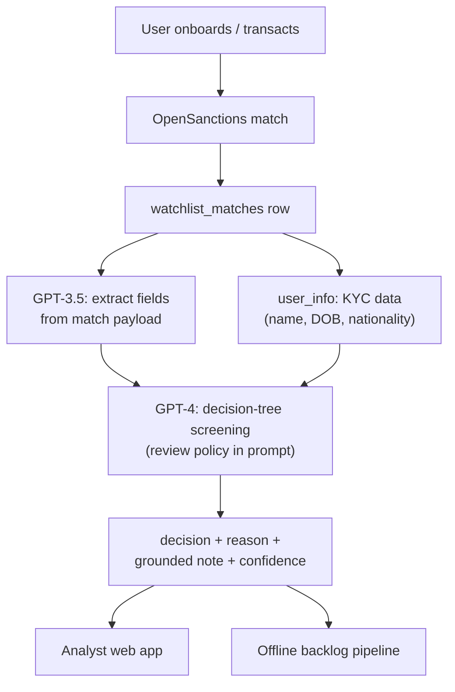

Sanctions screening generates an overwhelming majority of false positives, and you are not allowed to ignore a single one of them. A common name collides with a listed entity, an alert fires, and an analyst has to look at it. Alert volume grows with the user base while review speed is bounded by how fast a person can read, so the backlog is not a spike. It is the steady state.

ScreenGPT is the system we built at Chipper Cash to adjudicate those alerts. OpenSanctions returns a name match, GPT-3.5 extracts structured fields from the match payload, GPT-4 walks a decision tree encoded in its prompt, and the pipeline returns a decision with a written, data-grounded justification. A match takes about 20 seconds, and on a held-out evaluation set the system catches 93.55 percent of the matches that genuinely warranted escalation. That last number is the one the whole design protects.

## The design constraint

The two ways this system can be wrong are not equally costly. A false positive, an alert escalated that turns out to be nobody, costs an analyst a few minutes. A false negative, a true hit cleared, means a sanctioned person is onboarded and nobody looks again until an audit finds it. One error is measured in minutes, the other in enforcement actions.

So the system carries a deliberate bias: when in doubt, escalate. We would rather hand an analyst a hundred collisions to dismiss than clear one real hit. That asymmetry decides which model runs where, which metric gets protected, and how to read every number the system produces. [Part 2](/work/screengpt-trusting-an-llm) is entirely about measuring it.

## Where matches come from

The screening engine is OpenSanctions, self-hosted and re-architected to be configurable and version-controlled. The reason is custom data: beyond the global sanctions and PEP lists, each market has local regulatory lists that are not in the public corpus. A local regulator's CSV is converted into an OpenSanctions dataset with a small mapping file, and datasets compose, so a market screens against exactly the mix declared for it:

```yaml
datasets:
  - name: domestic_ngn_blocklist
    title: Domestic NGN PEP list
    path: /app/data/data.json
    version: '20230401004'
  - name: nigeria
    title: Custom Nigeria List
    datasets:
      - domestic_ngn_blocklist
      - sanctions
```

The version number is load-bearing: bumping it re-indexes the dataset in Elasticsearch, which is how an updated local list reaches the live index. Screening `/match/nigeria` hits exactly the built-in sanctions data plus the local list, nothing else.



Every hit lands as a row in a `watchlist_matches` table: a user whose identity matched something on a list. That row is where the pipeline picks up.

## Two models, one decision

The pipeline takes a match ID and returns a screening decision, and its one load-bearing design choice is using two different models for two different jobs.

GPT-3.5 handles extraction. The raw OpenSanctions payload is verbose and inconsistent, and parsing it into clean fields is bounded, mechanical work that a cheap model does well. GPT-4 handles the decision. Its prompt encodes our watchlist review procedure as a decision tree: compare names, then date of birth, then gender, then nationality, clear on a hard mismatch, escalate by default when a field is absent. The model is not freelancing a judgment; it executes the same policy a trained analyst would, against the same data.

The split is the cost structure and the risk structure at once. Extraction is high-volume and low-stakes, so it goes to the cheap model. The decision is where being wrong is expensive and the reasoning must hold up to audit, so it gets the capable model. Reversing either assignment pays for reasoning you do not need, or saves money exactly where the asymmetry says you must not. It is also what makes running the entire backlog affordable, which is the subject of [Part 3](/work/screengpt-in-production).



## An output built to be checked

The pipeline returns four plain fields: a `decision` (`NO_MATCH` or `POTENTIAL_MATCH_ESCALATED`), a `decision_reason` naming the branch of the tree that fired, a `note`, and a `confidence` (`Strongly Agree`, `Agree`, or `Neutral`).

The note is what makes the system usable. A bare `NO_MATCH` is an oracle, and you cannot audit an oracle. A `NO_MATCH` accompanied by "the listed entity was born in 1962 in a different country, the user was born in 1991, and the names share only a common first name" is something an analyst can verify in seconds and a regulator can review after the fact. Every decision carries its own justification, which is the difference between a tool an analyst trusts and a black box they redo by hand.

ScreenGPT is decision support, not a replacement for the analyst. In the interactive path, an analyst pulls up a match, reads the decision and its note, and confirms or overrides. The model does the first pass; the human keeps the final say. Beyond throughput, that buys consistency, the same policy applied the same way across cases and analysts, and it lets screening managers point human attention at the genuinely ambiguous cases instead of the hundredth name collision of the morning.

## Performance, briefly

On a 269-case evaluation set, overall accuracy is 78.44 percent, and by itself that number is not very interesting. The ones that matter: when ScreenGPT says clear, it is right 92.23 percent of the time, and of the matches that genuinely warranted escalation, it catches 93.55 percent. The system is deliberately loose in the safe direction, escalating a meaningful share of clearable cases, and strict in the dangerous one. That is backwards for maximizing accuracy and exactly right for never clearing a true hit.


_Precision and recall by class. POTENTIAL_MATCH recall, 93.55 percent, is the metric the asymmetric cost of errors protects._

How that evaluation was built, the golden dataset, the confusion matrix, and the win/loss review behind these numbers, is [Part 2](/work/screengpt-trusting-an-llm). How the same pipeline drains a 148K-alert backlog unattended, what it costs, and the day it failed silently, is [Part 3](/work/screengpt-in-production).
