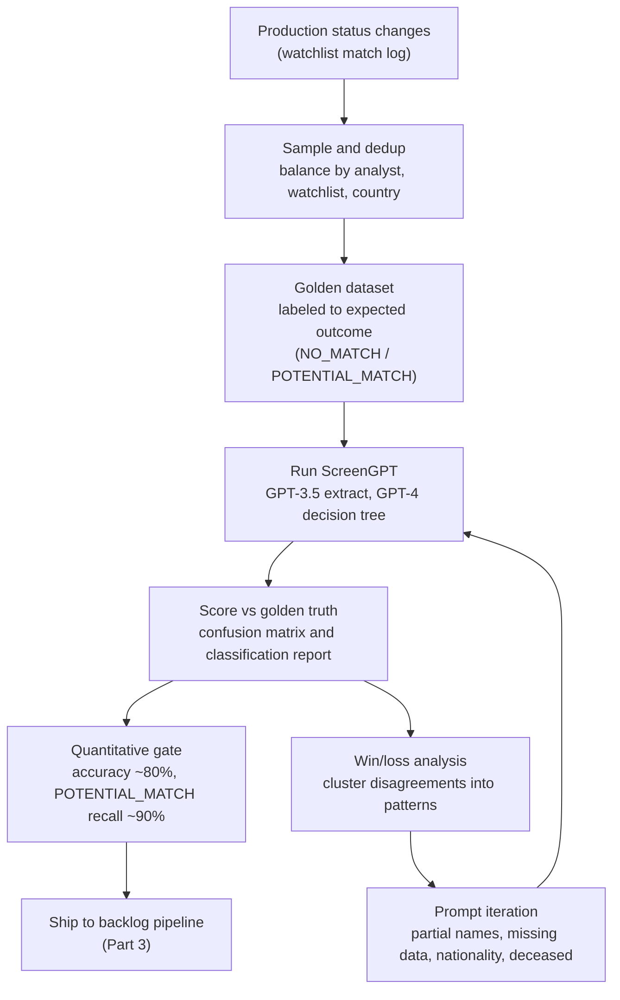

How do you earn the right to let an LLM make a compliance decision? Not with a demo. A demo is a sample of one, picked by the person who wants you to believe it. When ScreenGPT clears a sanctions-screening alert it is deciding whether a person can move money, and most of the time that decision is correct and boring. Occasionally it is the difference between a routine onboarding and onboarding a sanctioned individual, which is a regulatory breach.

In [Part 1](/work/screengpt-the-system) I described ScreenGPT: a two-model pipeline that adjudicates sanctions and watchlist alerts. GPT-3.5 extracts structured fields from the OpenSanctions match payload, GPT-4 runs the decision against a decision-tree prompt that encodes our review policy, and the output is a decision (NO_MATCH or POTENTIAL_MATCH_ESCALATED), a reason, a grounded note, and a confidence level. That piece answered how it works. This one answers the harder question: why anyone let it make the call.

The answer is a measured evaluation that is honest about the one error you cannot afford. This is the story of that evaluation: the golden dataset we built as a source of truth, the confusion matrix we scored against it, and why a single recall number became the metric we protect above everything else.

## The decision you cannot afford to get wrong

Everything that follows is driven by an asymmetry. A screening alert has two adjudications. NO_MATCH means the name collision is a coincidence, a common name colliding with a listed entity. POTENTIAL_MATCH means it might be real and a human has to escalate and investigate. The overwhelming majority of alerts are NO_MATCH, which is why the backlog exists in the first place.

There are two ways to be wrong about them, and they do not cost the same. A false positive is an escalation that should have been a clear: ScreenGPT says POTENTIAL_MATCH, the truth is NO_MATCH, and an analyst spends a few minutes confirming there is nothing there. Annoying, bounded, recoverable. A false negative is a clear that should have been an escalation: ScreenGPT says NO_MATCH, the truth is POTENTIAL_MATCH, the alert is closed, and nobody looks again. That is a regulatory breach, and no analyst minute fixes it after the fact, because the whole point of the false negative is that no analyst ever sees the case.

One error is measured in minutes, the other in enforcement actions. When the cost of errors is that asymmetric, accuracy is the wrong headline metric, because accuracy treats both errors as equal: a model can post a beautiful accuracy number while making exactly the mistake you cannot tolerate. So before we scored anything, we decided what we were optimizing. Not how often ScreenGPT agrees with the analyst, but how rarely it misses a true match. The rest of the evaluation exists to protect that.

## The golden dataset

You cannot measure any of this without a source of truth, and the obvious one is wrong. Scoring the model against analysts' recorded production decisions sounds right until you remember that analysts misread records, fat-finger buttons, and get tired at the end of a shift. Score against raw analyst clicks and you are measuring agreement with a noisy label, not correctness. So the first thing we built was a **golden dataset**: a hand-curated benchmark labeled to the _expected outcome_ of each case rather than to whatever the analyst happened to click. When an analyst had clearly made a mistake, the golden label reflected the truth, not the mistake. That is the difference between a benchmark and a transcript.

We sampled from real production data. Every adjudication writes a row to our watchlist status-change log, which carries the full vocabulary of workflow statuses: new, false-match, no-match, potential-match, potential-match-escalated, true-match-allowed, true-match-blocked, further-investigation-required, and more. For scoring we collapse all of that to the binary ScreenGPT actually decides, NO_MATCH versus POTENTIAL_MATCH. The log also held duplicates, the same match changing status more than once, so building the set meant some plain data hygiene: dedup on the match and the prior status before sampling.

Four design principles held the set together. We curated for **diverse scenario coverage**, because a thousand near-identical easy clears tell you nothing, and for **accurate labels**, scored to expected outcome rather than recorded click. We deliberately overweighted **boundary scenarios**, the ambiguous edge cases where a model is most likely to underperform: transposed names, missing middle names, partial matches, missing nationality. The easy cases do not discriminate between a good model and a bad one; the boundary cases do. Finally we controlled for the variables that quietly bias a benchmark, which analyst reviewed the case, which watchlist, which country, and watched the underlying class imbalance during sampling. That is why the final supports are 145 NO_MATCH and 124 POTENTIAL_MATCH rather than a tidy 50/50. A benchmark accidentally skewed toward one class will lie to you about that class.

Each record is small and boring on purpose: a decision, a reason, the identifiers for the match and the reviewer, a timestamp.

```json
{
  "decision": "NO_MATCH",
  "decision_reason": "2. Mismatch - Name does not match",
  "watchlist_match_id": "<uuid>",
  "admin_id": "<uuid>",
  "timestamp": 1668494124236
}
```

The design lever sits inside this dataset. Because the golden set measures precision and recall on each class independently, it lets us tune ScreenGPT deliberately conservative (favor escalation, accept more false positives) or deliberately aggressive (favor precision, accept more false negatives), depending on which error costs more. For a sanctions decision that question is never in doubt. The golden dataset is what turns the conviction into a dial we can actually set.

## Scoring it: the confusion matrix

Scoring is then mechanical: run ScreenGPT over the held-out set, compare each binary decision against the golden label, count the four outcomes. We scored against **269 cases**, 145 truly NO_MATCH and 124 truly POTENTIAL_MATCH.


_Figure 1: ScreenGPT versus analyst judgment, 269 cases. Rows are the golden truth, columns are ScreenGPT's decision. The eight false negatives in the lower-left are the only errors that carry regulatory cost; the fifty false positives in the upper-right cost analyst minutes._

Read the four cells the way the asymmetry tells you to. The **95 true clears** are genuine NO_MATCH cases ScreenGPT correctly cleared, pure throughput an analyst never has to touch. The **116 true escalations** are genuine POTENTIAL_MATCH cases routed to a human exactly as they should be, and this is the count that protects the program. The **50 false positives** are NO_MATCH cases ScreenGPT escalated anyway, the cost we agreed to pay: fifty analyst reviews that a perfect model would have spared. The **8 false negatives** are POTENTIAL_MATCH cases ScreenGPT cleared, the cell to watch, and it is the smallest on the board: eight out of 124 true matches.

Hold the two error counts next to each other, 50 against 8. The model makes the cheap mistake six times more often than the expensive one. That is not an accident in the data; it is the shape we tuned for.

## Why we protect POTENTIAL_MATCH recall

Turn the confusion matrix into the two metrics that carry the argument.


_Figure 2: Precision and recall by class. NO_MATCH precision 92.23%, recall 65.52%. POTENTIAL_MATCH precision 69.88%, recall 93.55%. We accept low NO_MATCH recall to keep POTENTIAL_MATCH recall high, because missing a true match is a breach and an extra escalation is a minute of analyst time._

The full classification report on the 269 cases:

| Class           | Precision | Recall     | Support |
| --------------- | --------- | ---------- | ------- |
| NO_MATCH        | 92.23%    | 65.52%     | 145     |
| POTENTIAL_MATCH | 69.88%    | 93.55%     | 124     |
| **Accuracy**    |           | **78.44%** | **269** |
| Macro avg       | 81.06%    | 79.53%     | 269     |
| Weighted avg    | 81.93%    | 78.44%     | 269     |

The number this whole piece is built around sits in the second row: **POTENTIAL_MATCH recall, 93.55 percent.** Recall on this class is the fraction of all true matches ScreenGPT actually escalated, precisely one minus the false-negative rate. At 93.55 percent it caught 93.55 percent of true matches and missed 6.45 percent, and the eight false negatives are that 6.45 percent. This is the metric that prevents the error we cannot afford, so this is the metric we protect.

Look at what we gave up to keep it there. NO_MATCH recall is **65.52 percent**, which in isolation looks bad: the model correctly identifies only about two-thirds of the genuine clears. But failing to identify a NO_MATCH means escalating something that did not need escalating, the cheap error. We would rather falsely escalate than miss a true match, so we accept a NO_MATCH recall in the sixties on purpose. The 50 false positives are that decision made visible. The two halves are the same lever pulled one way: bias the model toward escalation to push POTENTIAL_MATCH recall up, and NO_MATCH recall mechanically drops. You cannot have both high at once on a hard, unbalanced set. The golden dataset let us see exactly where that trade sat and choose the side we could live with.

The same conviction shows up two ways in our own documents, worth naming so the two numbers do not read as conflicting goals. In the GPT-3.5 era we wrote the target as "NO_MATCH precision at 90 percent or higher"; in the GPT-4 evaluation we wrote it as "POTENTIAL_MATCH recall at 90 percent or higher." High NO_MATCH precision means you almost never clear something you should have escalated; high POTENTIAL_MATCH recall means the same thing. Both are views of a single commitment: do not miss a true match. NO_MATCH precision landed at 92.23 percent and POTENTIAL_MATCH recall at 93.55 percent, both clear of 90, and the commitment held under both framings.

We set two benchmarks before scoring and the model met both: roughly 80 percent accuracy and 90 percent recall on POTENTIAL_MATCH. Measured accuracy came in at 78.44 percent and recall at 93.55 percent. Recall cleared comfortably; accuracy essentially met the rounded benchmark, and the next section explains why the unrounded 78.44 understates the truth.

## The numbers undersell the model

78.44 percent accuracy is a floor, not the real number. Working back through the disagreements case by case, a chunk of them were not the model being wrong but the model being right and the recorded label being wrong. Several false positives were technically correct escalations: ScreenGPT escalated, the analyst cleared, and ScreenGPT was right under our own policy. The clearest example is deceased individuals, a fact absent from OpenSanctions, so the model had no way to know and correctly escalated by procedure while the analyst cleared on outside knowledge. The disagreement counts against accuracy, but the model did the right thing with the data it had. Others were analyst mis-clicks. Review happens in a web interface where the analyst marks AGREE or DISAGREE and leaves a note, and in more than five cases the note says the analyst agreed while the recorded click says DISAGREE. Each is a phantom disagreement scored against a model the human sided with in writing.

Correct for both and accuracy moves toward 85 percent. We keep reporting 78.44 percent because it is what the raw scoring produced and we would rather under-claim than over-claim on a compliance system, but the honest read is that true alignment with a careful analyst sits closer to 85 than to 78.

## Win/loss: reading every disagreement

A confusion matrix tells you how many you got wrong, not why, and why is the only thing that lets you fix the model. So we did a win/loss pass over every disagreement and clustered them into patterns. This is where evaluation stops being a scoreboard and becomes a punch-list.

### The 8 false negatives

The eight false negatives are the expensive cases, where the model cleared an alert a human escalated, so we read all eight rather than summarizing. They did not scatter. Two were analyst typos the analyst conceded on review, where the model was actually right: one had a mismatched year of birth in the record, and one had a citizenship mismatch (a Nigerian user against a non-Nigerian listed entity) that policy treats as NO_MATCH. One was a data gap the model could not have caught, a real alias match missing from the OpenSanctions record ScreenGPT was given. The remaining five were genuine disagreements, and every one reduces to the same question: how aggressively should the model treat a partial, transposed, or one-letter-off name as a match? "Hassan" against "Hassam" is one transposed letter; "Ahmad Sidi" against "Ahmed Saidi" is a reordered and slightly respelled name. The model and the analyst simply drew the line in different places. The false negatives were not scattered failures of reasoning but a single fixable policy ambiguity, and the fix was not a smarter model, it was a sharper partial-match rule in the prompt.

### The 50 false positives

The 50 false positives, bucketed by cause:

| Pattern                        | Count | What it is                                                                                                            |
| ------------------------------ | ----- | --------------------------------------------------------------------------------------------------------------------- |
| Name mismatches                | 17    | Partial and middle-name handling, the same root cause as the false negatives                                          |
| KYC / document mismatch        | 12    | Identity document points one way, match record another; e.g. a Nigerian document against a non-Nigerian listed person |
| Nationality / country mismatch | 10    | Nationality missing from OpenSanctions or unparsed; model escalates by procedure                                      |
| Miscellaneous                  | 8     | Alias mismatches and assorted edge cases                                                                              |
| Deceased individuals           | 3     | Listed person is deceased; that fact is not in OpenSanctions, so escalation is correct                                |

The 17 name mismatches and the partial-name false negatives are the same problem wearing two hats. Inconsistent partial and middle-name handling is the single largest fixable loss pattern in the evaluation, and it appears on both sides of the confusion matrix; fix it once in the prompt and you tighten both columns. The nationality (10) and KYC/document (12) buckets, 22 cases together, are not reasoning failures at all but data-availability problems: when nationality is missing from the OpenSanctions record, ScreenGPT cannot rule a match out on it and correctly escalates by procedure. You fix that by enriching the input, not by retraining. The three deceased cases are the same story. Subtract those and the typos the analyst conceded, and the true false-positive count is meaningfully below 50. The model is more precise than the raw number says, on both classes.

## How evaluation drove iteration

None of this started at GPT-4. The decision-tree prompt Part 1 describes is the output of an earlier loop, and that loop is the actual mechanism by which evaluation made the model better. In the GPT-3.5 era the losses clustered into two failure modes. The first was failing to escalate, the dangerous direction: the model read transposed names as different people ("Jon Doe" against "Doe Jon"), treated a missing date of birth as a reason to clear, and read a missing middle name ("John F Kennedy" against "John Kennedy") as a mismatch. The second was being too fast to escalate, escalating on flimsy grounds; in our notes the model was "too clever sometimes," inventing a data-entry error to explain away a gender mismatch instead of treating it as a real signal. That pass also surfaced wrong labels in the golden dataset itself, which sent us back to relabel: the benchmark improves in the same loop the model does.

Those patterns became prompt rules. Transposed-name handling was made explicit with worked examples: "Jon Doe" and "Doe Jon" are the same name, treat it as a match. Middle names became low priority, with one exception, that conflicting middle names on both records are a mismatch. And the whole thing was structured into the ordered decision tree GPT-4 now runs: names, then date of birth, then gender, then nationality, clearing on a hard mismatch at any step and escalating by default when a field like nationality is simply absent.

That loop is the most important idea in this piece:



_Figure 3: Evaluation as a loop, not a gate. The golden dataset drives scoring; win/loss analysis turns disagreements into prompt fixes; the iterated prompt is re-scored against the same held-out set. The quantitative gate is what eventually lets the model ship._

GPT-4 does the decision step because the 3.5 win/loss showed the failures were reasoning failures, the kind a stronger model handles better, sitting on top of a policy GPT-3.5 had helped us write down precisely. We kept GPT-3.5 for the cheap, mechanical field extraction and moved the judgment to GPT-4. That split came out of the evaluation, not a preference for the bigger model.

## Earning the right to ship

The 269-case set was held out, deliberately unbalanced toward the hard cases, and curated to expected outcomes rather than analyst clicks. ScreenGPT met both pre-set benchmarks: roughly 80 percent accuracy, nearer 85 once mis-clicks and technically-correct escalations are accounted for, and 90 percent recall on POTENTIAL_MATCH, landing at 93.55 percent. Clearing a held-out, adversarially-sampled set is the evidence that the model generalized rather than memorized the cases we first showed it. That is what bought the right to ship ScreenGPT into the offline backlog pipeline, where it runs unattended at volume. The pipeline economics, throughput and latency and cost, and the September 2024 regression that this same evaluation discipline eventually caught, are the subject of [Part 3](/work/screengpt-in-production).

The line that survived the whole evaluation is this: when the cost of errors is asymmetric, you do not optimize accuracy. You pick the error you can afford and protect the metric that prevents the one you cannot. For us that metric was POTENTIAL_MATCH recall, and 93.55 percent was the number we refused to trade.
