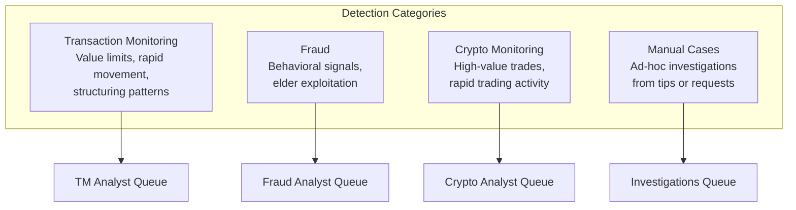
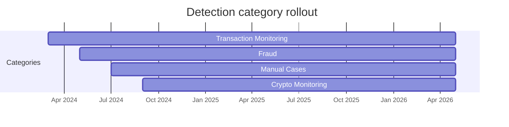
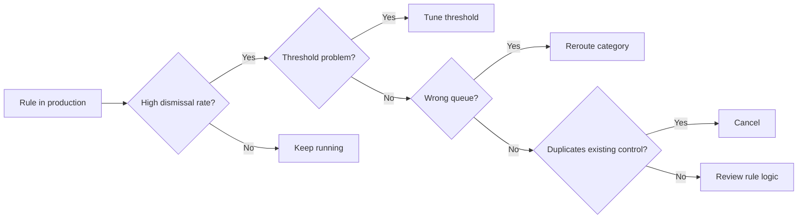

This is the third of three pieces on the compliance platform: [why I built it](/work/replacing-a-compliance-vendor), [its architecture](/work/designing-the-compliance-platform), and, here, the detection layer. How I write transaction monitoring rules, how I organize them across markets, and how I decide which ones to keep and which to retire.

## Why dbt is our rules engine

I didn't build a separate detection system. Every transaction monitoring rule at Chipper is a dbt model: a SQL query that reads transaction data and outputs the users in violation.

This keeps detection inside the same stack our data team already works in. We don't maintain a parallel deployment pipeline, write rules in a proprietary language, or wrap the SQL in an abstraction layer. When something looks wrong, an engineer opens the dbt model and reads the query.

Adding a new rule means writing one SQL model. The model ships through the same dbt CI pipeline that handles every other data model, so there are no API contracts to coordinate or schemas to migrate. Disabling a rule is simpler still: a boolean flag on the rule's row. The low overhead is the point. Iteration matters more than any single rule being correct at launch.

## Four detection categories

Rules are organized into four categories. Each maps to a different compliance concern and routes alerts to a different analyst queue.

**Transaction Monitoring** covers the regulatory baseline: value limits on sends and receives, large deposits followed by transfers, rapid movement of funds, and unusual card activity. These are the patterns regulators expect us to detect, and they generate the highest alert volume.

**Fraud** covers behavioral signals that fall outside standard TM patterns, including language anomalies, age-based exploitation risk, and account-level red flags. These cases need different investigative context than TM reviews, so they route to a separate queue staffed by analysts trained on fraud typologies.

**Crypto Monitoring** tracks high-value trades, rapid trading activity, and patterns where crypto transactions correlate with P2P fund flows. We kept it as a separate category because the patterns and thresholds diverge enough from fiat workflows that combining them would have created noise on both sides.

**Manual Cases** exist because automated rules cannot catch everything. Analysts open them based on ad-hoc tips, external requests, or patterns they notice during other reviews. The system creates a case from a `user_id` alone, using the same machinery as automated ones: audit trail, status lifecycle, MLRO escalation if needed.

The categories were not all present at launch. I rolled them out in sequence, validating each before adding the next.

Each addition expanded coverage without touching the core case management system. The work was the same each time: add rows to the RULES table, write the new dbt models, and watch alerts flow into the right queue.

## Five principles for standardizing rules

When I migrated off the vendor, I inherited years of rule debt. Each rule had its own output schema, its own time horizon, and hardcoded values that no one could explain without reading the SQL line by line. The migration was the moment to impose order.

I standardized on five principles.

**One output contract.** Every rule outputs the same two columns: the flagged user and the list of transactions that triggered the flag. The TM engine doesn't need to understand anything beyond that, which means a new rule plugs into the pipeline with no integration work.

**One time horizon.** Rules operate on a 24-hour rolling window unless there is a documented exception. The window is anchored to `current_timestamp` rather than `current_date`, which avoids edge cases around day boundaries and runs that span midnight. Consistent windows give us predictable alert volumes, simpler scheduling, and clearer analyst context. Rules that need historical comparisons, like checking whether recent activity deviates from a user's baseline, document the lookback and the reason for it.

**Documented intent.** Every rule carries a plain-language description in the dbt schema file. Before standardization, some rules had names that did not match the SQL they ran. Writing descriptions forced us to audit whether the logic matched the intent, and in several cases it did not.

**No magic numbers.** Thresholds are expressed per currency, inline in the SQL, with a comment explaining the value. Before standardization, a hardcoded number in a WHERE clause required Notion archaeology to decode. Now the threshold, the currency, and the reasoning all sit in the model itself.

**Thresholds track the product.** When transaction limits or KYB caps change, the rules update with them. I found several rules running with thresholds set at market launch and never revised since. The standardization pass aligned every rule with current product limits, and we built the habit of revisiting thresholds whenever the limits move.

## Multi-market coverage

Most rules apply across all markets. The detection logic is the same; only the thresholds change by currency. A value-limit rule in Nigeria and a value-limit rule in Uganda check the same pattern, cumulative volume exceeding a cap, calibrated to the local currency and market.

Business accounts have their own thresholds, typically higher, reflecting expected volumes. The dbt model handles both retail and business users in a single query with a conditional on user type and currency.

This pattern, same logic with market-specific calibration, repeats across most of our rules. It keeps the rule count manageable: one model that scales across currencies, rather than a separate rule per market.

The exceptions are rules tied to specific product lines. Crypto monitoring rules only run in markets where crypto is enabled, and card rules only run where virtual cards are live. These constraints live inside the SQL itself, not as separate rule entries.

## When to tune, reroute, or cancel

Detection is not a set-and-forget system. I treat rule maintenance as ongoing work, with three modes of intervention.

### Tune: adjust the threshold

A rule with high volume but a low escalation rate is usually a threshold problem. The pattern it detects is valid, but the sensitivity is wrong for the market. Adjusting the threshold preserves the detection logic while reducing noise.

I track dismissal rates by rule. When a rule consistently dismisses above 90%, it becomes a candidate for threshold review. The goal isn't to eliminate false positives entirely, which would reduce coverage, but to keep the signal-to-noise ratio in a range where analysts trust the queue.

### Reroute: move it to the right queue

Sometimes a rule generates useful alerts but sends them to the wrong team. Elder Abuse is the clearest example. It originally routed to the Transaction Monitoring queue, but the analysts working TM reviews didn't have the right context for exploitation cases. Moving it to the Fraud queue, where analysts are trained on those typologies, improved both the quality of reviews and the speed of resolution. The rule logic itself didn't need to change; only the `rule_category` field did.

### Cancel: remove it entirely

I've designed rules that didn't survive contact with production. Six of them have been cancelled since launch.

The pattern was consistent: either the rule duplicated a control that already existed elsewhere in the system, or the false positive rate was so high that the signal couldn't be recovered through threshold adjustment. Specifically:

- Rules that duplicated controls built into the card program itself were redundant.
- Rules that flagged normal behavior, like returning to a dormant card or loading your own card, produced alerts with no investigative value.
- Rules where the majority of alerts came from a single benign pattern, such as self-funding, couldn't be tuned down without also suppressing the genuine signal.

Cancelling a rule is a decision, not a failure. Every noisy rule that stays active erodes analyst trust in the system and consumes review capacity that could go to higher-signal work.

## Measuring what matters

With all rule data in Snowflake, we measure three things.

**Dismissal rate per rule.** This is the primary signal for noise. A rule that dismisses at 99% is either miscalibrated or detecting a pattern that isn't actually suspicious in practice, while a rule dismissing at 45% is doing real work.

**Escalation rate per rule.** This shows where genuine suspicious activity concentrates. The rules with the highest escalation counts are the ones driving the most MLRO reviews and SAR filings, and they're the rules we protect and invest in.

**Coverage by category.** We track how many distinct detection patterns are active across each category and market. When a new product launches or a new market opens, the question is whether the existing rule set covers the expected transaction patterns, and if not, what rules to add.

## What we learned

**Keep the rules close to the data.** Detection lives in the same stack as the rest of the data platform, which means no separate system to maintain and no integration layer to break.

**Standardization compounds.** A consistent contract between rules and the pipeline means every new rule benefits from the work done on the first one. Engineers spend their time on detection logic, not plumbing.

**Analysts are the best tuning signal.** Dashboards tell you a rule is noisy, but only the analysts working those alerts can tell you why. That distinction determines whether you adjust a threshold, reroute a category, or cancel the rule entirely.

**Cancel early.** Six rules did not survive production. Each cancellation freed analyst capacity for higher-signal work, and the discipline of removing rules turns out to be as important as the discipline of creating them.

## Wrapping up

Across three posts, I've covered the full arc of building the compliance platform:

- [Replacing a compliance vendor](/work/replacing-a-compliance-vendor): why I replaced the vendor, how I scoped the MVP, and the feedback loop that shaped the tool.
- [Designing the compliance platform](/work/designing-the-compliance-platform): the data model, controllers, and design decisions behind a system that has processed 20,000+ cases.
- This piece: the detection framework, standardization principles, and the discipline of tuning rules in production.

If your compliance team is paying for a vendor tool that doesn't integrate with your data stack, the alternative may be simpler than you think. The core of the system is six Postgres tables, a Python script, and a Retool app. The hard part is understanding what your analysts actually need.
