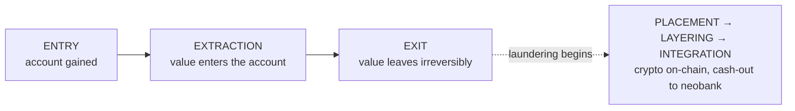
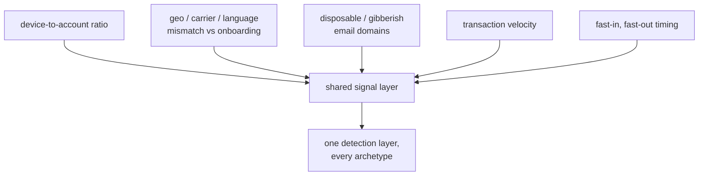

A recurring fraud pattern is a fraud archetype: a reusable exploit defined by three fixed properties, a known entry point, a known way of extracting value, and a known set of tells. Classifying a case as a known archetype is what makes the fraud controllable. Instead of investigating each instance as a novelty, we can engineer against a pattern we have already seen. That is the value of a catalogue: a fraud solved once is a fraud solved for every case that matches it.

What follows is that catalogue: the exploits we paid for in fraud losses, with the scars to prove it. For each, we break down its lifecycle, mechanics, tells, and how analysis closed the gap. The fixes are sketched only lightly, because each is the subject of its own deep dive later in the series.

## The lifecycle: entry, extraction, exit

Every archetype, regardless of mechanism, moves value through three stages.

**Entry** is how an account is gained. It might be opened honestly and then sold, mass-created from stolen identities, taken over through social engineering, or onboarded clean and turned later. The entry stage answers one question: who actually controls this account, and is that the person who passed KYC.

**Extraction** is how value enters the account. A deposit, a referral payout, an inbound transfer, a linked bank pull, a chargeable card. This is where the platform's money or a victim's money lands somewhere the fraudster can access.

**Exit** is how value leaves irreversibly. Crypto bought and sent on-chain. A withdrawal to another neobank. Cash collected off-platform. The defining property of the exit stage is that it is hard or impossible to claw back, which is exactly why fraudsters race toward it.

The exit is also where fraud meets money laundering: the fraudster's exit is the launderer's placement and layering. For example, when value is converted to crypto on-chain or cashed out to another neobank under a different name. The thesis of this catalogue is an operational one: because the same handful of signals recur across different exploits, a shared detection layer always beats per-incident firefighting. That reality shapes every lesson below, where the work always came down to finding _tells_ fraudsters cannot hide and building controls around them.

## Referral fraud

> Mass-created accounts farming referral payouts, hidden inside a real viral growth curve.

_Lifecycle stage: Entry → Extraction_

**How it works.** A referral program pays a reward when a new user signs up under an existing code. The fraud is mechanical: create accounts at scale, point them at one referrer's code, collect the payouts. We noticed that referrals spiked to roughly 50,000 a day against user growth of around 60,000, briefly hitting 1,200 requests per second and threatening the servers. We paused the campaign and later estimated around 20% of referrals in that window were fraudulent, driven by fake and stolen BVNs.

The hard part was not detecting volume but that legitimate virality looks identical to fraud at the top of the distribution. Most real referrers brought in three to eight friends; genuine super-referrers sharing codes on Twitter, YouTube, and WhatsApp brought in fifty or more. You cannot punish volume alone without burning your best growth.

**The tells.**

- Tight IP clusters across a referrer's downline
- Accounts created in batches within narrow time windows
- Fast settlement of payouts with no subsequent genuine activity
- The decisive one: identical selfies with different BVN data

**Closing the gap.** During the largest referral surge, none of the existing gibberish-name heuristics triggered, forcing the investigation to look beyond the usual signals. We pulled liveness selfies for accounts associated with the same referral code and reviewed them side by side. The same faces repeatedly appeared across supposedly unrelated accounts, often under different identities. The resulting control was the Referral Validation Service, which combined IP clustering, identity-quality signals, and fake-name likelihood modeling to identify coordinated referral abuse.

## Chargeback fraud

> Verified cards depositing real money, withdrawn fast, then disputed weeks later as never received.

_Lifecycle stage: Extraction → Exit_

**How it works.** Chargebacks went from roughly 30 a day to over a thousand; one day alone saw 1330. The disputes were coded "goods or services not provided" even though the funds had been credited and withdrawn. This is how the fraud works: the cardholder, or someone with the card, deposits, cashes out, then disputes the deposit with their issuer once the money is gone.

The repeated pattern we saw was an account links many verified cards, sometimes ten or more, makes large deposits above NGN 500,000 several times a day, and moves the money fast in and fast out. The dispute lands weeks or months later, when the balance is zero, leaving the liability to us.

**The tells.**

- An implausible number of verified cards on a single account
- Large clustered deposits followed by immediate withdrawal
- Many accounts operating on one device, sometimes fifteen or more
- Disputes arriving long after the funds have exited

**Closing the gap.** The fix came from modeling the features that predicted a fraudulent dispute before it happened: number of cards, device activity, transaction activity. That score gated card deposits for high-risk users, card deposits were stopped where the risk was clearest, and an auto-decline path generated ledger-based proof for each decline. The signal was always in the deposit behavior; the work was learning to read it weeks ahead of the chargeback.

## Account takeover

> A real user's account seized through social engineering, drained to crypto and other neobanks before the owner can react.

_Lifecycle stage: Entry → Exit_

**How it works.** Account takeover at scale began around 2023 when we had confirmed roughly 1,985 cases, peaking near 30 reports a day. This was not broken authentication, it was social engineering. Fraudsters posed as Chipper support, watched public support channels, direct-messaged users who were already complaining, and phished login details from people who believed they were getting help.

Once in, the sequence was fast and standardized: change the contact email to a disposable domain, reset the PIN and biometrics to lock the owner out, then convert the balance to crypto or withdraw it to another neobank. Some compromised accounts also _received_ funds from other victims, so a takeover doubled as a mule. The losses fell on users, because they had surrendered their own credentials.

**The tells.**

- Contact details changed shortly before unusual activity
- Email switched to a suspicious or temporary domain
- PIN or biometric resets immediately preceding withdrawals
- A new device transacting the moment it is added
- One device appearing across many accounts

**Closing the gap.** The game-changer was a selfie liveness challenge at the moment of risk: a phisher has the password but not the owner's face. New-device transaction holds of up to sixteen hours bought time, a bad-asset list caught repeat devices and emails, and user education attacked the entry point directly. Reports fell from roughly 30 a day to under ten per quarter, with fewer than ten across all of 2024. On the UX side of things, we placed liveness checks systematically, without introducing friction to legitimate logins.

## Spoofing and account sale

> A genuinely KYC'd account sold or handed to a third party, usually in a jurisdiction the platform does not serve.

_Lifecycle stage: Entry_

**How it works.** This archetype spiked in April 2024 and reached roughly 2,000 confirmed spoof accounts by late 2024. The pattern: a newly opened wallet whose owner requests removal of their identifiers, then swaps in new emails and phone numbers, often gibberish or disposable. The account was opened legitimately by one person who passed KYC, and then control was transferred to someone else, mostly outside Nigeria. The value being sold is the verified account itself. Some buyers even attempted the selfie liveness using a photo of a photo.

It is a nearly silent archetype. The original owner sold the account willingly, so there is no victim and no report. You only see it in the metadata.

**The tells.**

- Access from a carrier outside supported regions
- A foreign phone number or non-English language on a domestically onboarded account
- Identifier-removal requests soon after opening
- Disposable email domains
- More than three devices added in the first month
- Spoofed selfies, including photos of photos

**Closing the gap.** The risk here is regulatory, not direct loss: you cannot let a verified account run under an unknown third party in a jurisdiction you do not operate in, with an unverifiable source of funds. This remains the most open-ended archetype, still largely manual. The work in progress is turning the cluster of mismatch signals, carrier, language, device count, identifier churn, into a control that flags the handoff as it happens rather than after. The deep dive is the least finished story in the catalogue, and says so.

## ACH fraud (US corridor)

> Linked US bank accounts pulled for funds, then reversed or muled across the finalization lag.

_Lifecycle stage: Extraction → Exit_

**How it works.** ACH let users link a US bank account, verified through Plaid, and pull funds onto the platform. As with cards, verification confirmed the link, not the intent. The expected fraud return rate ran around 2% of payments; real-time scoring through Sardine brought losses to roughly 1% by the end of 2023, and the product was later discontinued.

Three variants recurred. **Reversal abuse:** deposit, spend, then return the ACH, exploiting the lag between when a transfer is initiated and when it finalizes. **Mule accounts:** opened by US users but operated by mules in Nigeria. **Elder fraud:** a vulnerable person's identity used, later reported as unauthorized. A small set of higher-risk banks, mostly consumer neobanks and prepaid-card brands, returned at materially higher rates than the baseline.

**The tells.**

- Deposits originating from a narrow set of high-return banks
- Deposit, spend, reverse timing that rides the finalization lag
- Geographic mismatch between where the account onboarded and where it operates

**Closing the gap.** The signal that mattered was timing against settlement: a legitimate user does not deposit, immediately spend, and reverse in a tight loop. Combining return-rate priors by originating bank with real-time behavioral scoring let us price the risk before finalizing.

## USD virtual-account fraud

> Inbound dollars to a Nigerian-held US virtual account, cashed out fast, reported fraudulent days later.

_Lifecycle stage: Extraction → Exit_

**How it works.** USD virtual accounts, built on Bridge, let Nigerian users receive dollars from US senders. The initial design was deliberately narrow: same-family-name transfers and verified freelance platforms only. Expanding it to non-family recipients and businesses widened the attack surface. Over roughly three months from August 2024 we saw about 32 reported fraudulent transactions totaling around $123K.

The mechanics were a race. Funds land, the user cashes out fast through withdrawals and crypto, and days later the originating institution reports the transaction as fraudulent, by which point the money is gone. The patterns were telling. Users went unresponsive after a report. Some requested a second virtual account, likely after the first was flagged elsewhere. Fake invoices were convincing enough to pass document review and release borderline payments. And much of the funding traced to third-party PayPal accounts with no clear relationship to the user, which is suspicious precisely because PayPal is available in Nigeria directly.

**The tells.**

- Fast cash-out of freshly arrived inbound credit
- Users going unresponsive after a fraud report
- Requests for a second virtual account
- Invoices that look legitimate but fail closer scrutiny
- Third-party funding with no plausible relationship to the account holder

**Closing the gap.** The interim control was a manual review queue staffed jointly by fraud and ops, with all third-party deposits placed on hold before release. The durable signal was the gap between inbound credit and cash-out speed, combined with funding-source relationship.

## Double-refund fraud

> The same transaction paid back twice, through a refund and a chargeback or a processing race.

_Lifecycle stage: Extraction_

**How it works.** Refund flows made to be paid out twice. The classic version pairs a merchant or processor refund with an issuer chargeback for the same transaction, reimbursing the cardholder from both sides. The other is a race condition in refund processing, where two refund requests for one transaction both settle because the system has not yet recorded the first. The defining feature is double recovery of a single payment.

**The tells.**

- A refund and a dispute that reference the same underlying transaction
- Duplicate refund references pointing at one original charge
- Refund requests clustered around known processing-lag windows

**Closing the gap.** The signal is reconciliation: a single transaction ID should map to at most one recovery path. The control comes from binding refunds and disputes to the same ledger entry and detecting when both fire.

## Crypto arbitrage fraud

> Pricing and settlement gaps in crypto rails worked against the platform rather than the market.

_Lifecycle stage: Extraction → Exit_

**How it works.** Crypto rails have gaps: stale quotes, rate-update windows, and settlement lag between fiat debit and crypto credit. Arbitrage fraud extracts value from those gaps, and crucially from the platform, not the open market. An account times round-trip buys and sells to a rate refresh, or works the window where a quote is honored but no longer accurate, repeating the loop while it stays profitable.

**The tells.**

- Rapid round-trip buys and sells timed to rate refreshes
- Concentration on specific pairs or corridors where the gap is largest
- Accounts whose entire activity is rate-sensitive crypto churn and nothing else

**Closing the gap.** The tell is behavioral monotony: a real user does not exist only to churn one pair against a refresh clock. The control narrows quote validity and scores accounts whose activity is purely rate-sensitive.

## Fake-agent fraud

> Impersonated cash-in and cash-out agents collecting deposits that never reach the victim's account.

_Lifecycle stage: Entry → Exit_

**How it works.** Agent networks let users deposit and withdraw cash through authorized intermediaries. Fake-agent fraud is impersonation: a bad actor presents as an authorized agent, collects cash from victims, and never credits them. The harm lands off-platform, on people who believed they were dealing with a sanctioned agent.

**The tells.**

- Agent-like inbound and outbound patterns from accounts never authorized as agents
- Clusters of victim complaints that trace back to a single operator
- Off-platform solicitation, where the approach happens outside the app entirely

**Closing the gap.** The signal is the mismatch between agent-shaped transaction behavior and authorized-agent status, plus complaint clustering around one node. The control verifies and visibly distinguishes real agents.

## Airtime irregularities

> Airtime purchase and resale used as a value-transfer or cash-out channel, or its promo mechanics exploited.

_Lifecycle stage: Extraction → Exit_

**How it works.** Airtime is a near-cash instrument, which makes it a vehicle for moving value rather than using it. The abuse takes two shapes: airtime bought and resold to move or cash out value, and exploitation of promo or reversal mechanics to manufacture value that was never spent.

**The tells.**

- Airtime purchase volume inconsistent with any plausible personal use
- Reseller-style patterns, where buying behavior looks like distribution
- Reversal or bonus exploitation, repeatedly triggering promo or reversal paths

**Closing the gap.** The tell is consumption that does not look like consumption: volume and cadence that only make sense for resale or promo farming. The control caps and scores airtime activity against a personal-use baseline.

## Why archetypes

A named archetype is a reusable unit. It carries a known set of signals, a known control, and a known failure mode. The moment you can say "this is account takeover" or "this is chargeback fraud," you inherit everything the team already learned, and the investigation starts from a hypothesis instead of a blank page.

Looking back, the same signals keep surfacing: device-to-account ratio, geographic and carrier and language mismatch, disposable emails, transaction velocity, fast-in and fast-out timing. That recurrence is not a coincidence. It is the argument for a shared, real-time monitoring layer that scores these signals once, for every archetype, instead of rebuilding detection per incident. A queue per incident rebuilds the same detector ten times. A layer built once detects all ten, and the eleventh you have not seen yet.

_This primer opens a series on fraud at a consumer fintech. Each post that follows takes one archetype from this catalogue and covers, in full, how the gap was closed._
